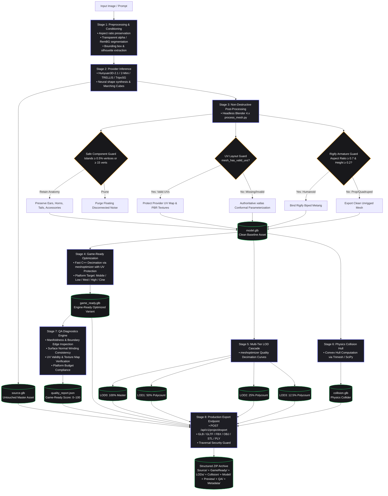

# AI Studio: 3D Quality Pipeline Specification

## 1. Architectural Overview

The AI Studio 3D Quality Pipeline coordinates image analysis, official provider inference, safe post-processing, multi-tier LOD generation, and asset packaging.

---

## 2. Stage Responsibilities

| Stage | Module | Responsibility | Invariants Preserved |
|---|---|---|---|
| **Inference** | `backend/app/core/providers/*` | Neural reconstruction from prompt or image. | Writes output file; retains high-fidelity raw mesh as `source.glb`. |
| **Mesh Cleanup** | `backend/app/core/blender/scripts/process_mesh.py` | Headless Blender cleanup & normal recalculation. | Component threshold preserves valid detached anatomy; existing UV maps are strictly protected; naive smart UV avoided. |
| **UV Parameterization** | `backend/app/core/mesh_optimizer.py` | Authoritative `xatlas` conformal parameterization. | Valid provider UVs left untouched (`uv_status: preserved_from_provider`); missing/corrupt UVs parameterized via xatlas charts (`uv_status: generated_via_xatlas`). |
| **Optimization** | `backend/app/core/mesh_optimizer.py` | Fast C++ `meshoptimizer` decimation & platform profiling. | Uses quality-aware edge collapse with boundary protection; respects UV boundaries. |
| **LOD Generation** | `backend/app/core/mesh_optimizer.py` | Cascade level calculation (LOD0–LOD3). | LOD0 is an exact byte-for-byte replica of the master asset; complexity strictly decreases per tier. Corrupt or non-reducing candidate LODs are validated via `validate_glb` and automatically discarded/unlinked. |
| **Collision** | `backend/app/core/mesh_optimizer.py` | Physics collider creation. | Produces single watertight convex hull proxy (`collider_type: convex_hull`) optimized for real-time physics simulation. |
| **QA Engine** | `backend/app/core/mesh_processor.py` | Non-destructive diagnostics & scoring. | Read-only inspection; outputs machine-readable validation dictionary. |
| **Export Engine** | `backend/app/api/v1/project.py` | Multi-format conversion & ZIP packaging. | Canonical formats (`glb`, `gltf`, `fbx`, `obj`, `stl`, `ply`). Real geometry conversion; structured ZIP with Source, GameReady, LODs, Collision, Model, Preview, QA, and Metadata. Traversal-safe storage access. |

---

## 3. Provider Quality Contracts

### Hunyuan3D-2.1
- **Official Pipeline & Architecture**: Official Tencent Hunyuan3D-2.1 dual-stage pipeline (`hy3dshape` DiT flow matching geometry synthesis + `hy3dpaint` PBR texture synthesis).
- **Fallback Transparency**: Clear degraded mode warning logs emitted if falling back to `hy3dgen`.
- **Inference Parameter Passthrough**: Full forwarding of quality parameters (`seed`, `num_inference_steps`, `guidance_scale`, `octree_resolution`, `num_chunks`, `face_count`).
- **VRAM Footprint**: ~16GB for shape+texture; ~8GB for shape-only.
- **Topology Characteristic**: High-density quad/triangle surface (~80k–120k tris).
- **Post-Processing Preset**: Medium or High platform decimation recommended for web rendering.

### TRELLIS
- **Official Weights & Inference**: Uses structured Flexicubes representation with PBR material outputs.
- **Sampler Controls**: Full propagation of `sparse_structure_sampler_params` (steps and cfg scaled by quality preset/request), `slat_sampler_params`, `seed`, shape-only inference (`formats=['mesh']` when `generate_texture=False`), and `texture_size`/`texture_resolution` passed to GLB export.
- **VRAM Footprint**: ~16GB standard; ~8GB low-VRAM mode.
- **Topology Characteristic**: Structured flexicubes (~40k–70k tris).
- **Post-Processing Preset**: Preserves crisp geometric silhouettes; auto-decimation to 30k recommended.

### TripoSG
- **Official Weights & Inference**: Fast single-image isosurface reconstruction.
- **VRAM Footprint**: ~6GB VRAM.
- **Topology Characteristic**: Dense Marching Cubes isosurface (~60k–80k tris, untextured).
- **Post-Processing Preset**: Decimation to 25k recommended; untextured base geometry.

### DetailGen3D
- **Official Architecture**: Second-pass geometry displacement/normal refinement.
- **Usage Contract**: Post-processing-only provider; cannot run as a standalone generation target.

