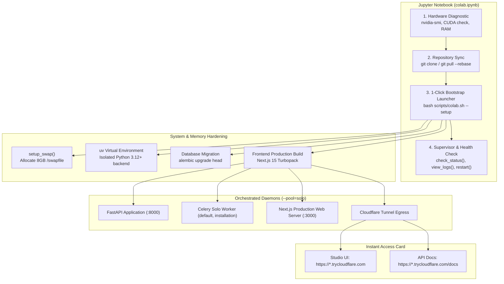

# Google Colab Setup & Deployment Guide

> **Version**: 5.0.81 (One-Click Notebook & 3D Detail Pipeline)  
> **Target GPUs**: Google Colab Free (T4 15GB), Pro/Pro+ (V100 16GB, L4 24GB, A100 40GB/80GB)  
> **Estimated Setup Time**: ~3-5 minutes  

---

## Overview

AI 3D Studio provides full first-class support for Google Colab environments via `colab.ipynb` and `AI_Studio_Colab.ipynb`. The notebook automates environment bootstrapping, 8GB swap memory allocation to prevent Linux kernel OOM kills, dependency isolation with `uv`, service orchestration, and secure Cloudflare public tunneling.

---

## One-Click Deployment Architecture

---

## Quickstart Steps

1. Open [Google Colab](https://colab.research.google.com).
2. Go to **File -> Upload notebook** and upload [`colab.ipynb`](../colab.ipynb) or [`AI_Studio_Colab.ipynb`](../AI_Studio_Colab.ipynb).
3. In the menu, go to **Runtime -> Change runtime type** and select a GPU (e.g. **T4**, **L4**, or **A100**).
4. Run **Cell 1**: Check hardware telemetry and GPU availability.
5. Run **Cell 2**: Clone or update the repository.
6. Run **Cell 3**: Click Play on the **1-Click Bootstrap Launcher**.
7. Once startup finishes, an interactive HTML card displays your public Cloudflare tunnel URLs:
   - **Studio Frontend**: Open to create 3D assets, edit voxels, inspect meshes.
   - **API Docs**: Swagger/OpenAPI documentation.

---

## Features & Resilience

- **8GB Swapfile Safety Net**: Colab free-tier instances provide only 12.7GB CPU RAM with 0 swap. Downloading heavy model weights (e.g., Hunyuan3D or TRELLIS) or building native packages can trigger the Linux kernel Out-Of-Memory (OOM) killer. `scripts/colab.sh` automatically allocates an 8GB `/swapfile` to ensure uninterrupted installation.
- **Headless Non-Interactive Mode**: Passing `--setup` or executing in headless subshells automatically detects non-interactive EOF and installs recommended models without blocking on interactive prompts.
- **Single-Worker Celery Pool**: To eliminate subprocess thread crashes and VRAM lock contention, Celery runs with `--pool=solo --concurrency=1`.
- **Browser Keepalive Guard**: An embedded JavaScript keepalive prevents browser tab inactivity timeouts.
- **Maintenance Cell**: Cell 4 provides helper routines:
  - `check_status()`: Inspect running daemon PIDs and listening ports.
  - `view_logs(service="fastapi")`: Tail live logs from `fastapi`, `celery`, `nextjs`, or `watchdog`.
  - `restart_services()`: Gracefully cycle all background daemons.
