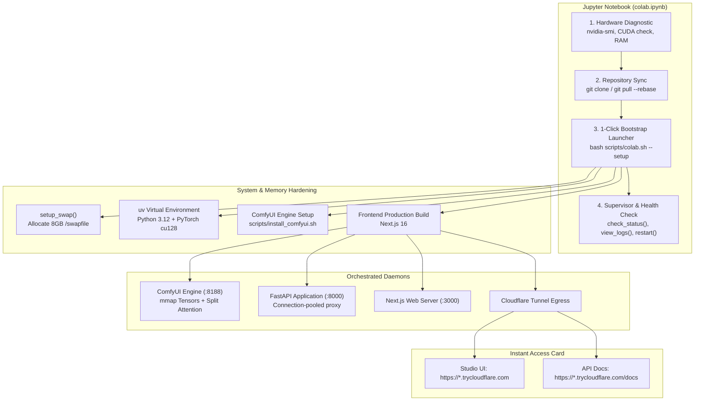

# Google Colab Setup & Deployment Guide

> **Version**: 6.0.0 (ComfyUI Core + ComfyUI-3D-Pack Engine)  
> **Target GPUs**: Google Colab Free (T4 15GB), Pro/Pro+ (V100 16GB, L4 24GB, A100 40GB/80GB)  
> **Estimated Setup Time**: ~3-5 minutes  

---

## Overview

AI 3D Studio provides first-class support for Google Colab environments via `colab.ipynb` and `AI_Studio_Colab.ipynb`. The notebook automates environment bootstrapping, 8GB swap memory allocation to prevent Linux kernel OOM kills during heavy tensor operations, dependency installation, service orchestration (ComfyUI + FastAPI + Next.js), and secure Cloudflare public tunneling.

---

## One-Click Deployment Architecture

---

## Quickstart Steps

1. Open [Google Colab](https://colab.research.google.com).
2. Go to **File -> Upload notebook** and upload [`colab.ipynb`](../colab.ipynb) or [`AI_Studio_Colab.ipynb`](../AI_Studio_Colab.ipynb).
3. In the menu, go to **Runtime -> Change runtime type** and select a GPU (e.g. **T4**, **L4**, or **A100**).
4. Run **Cell 1**: Check hardware telemetry and GPU availability.
5. Run **Cell 2**: Clone or update the repository.
6. Run **Cell 3**: Click Play on the **1-Click Bootstrap Launcher**.
7. Once startup finishes, an interactive HTML card displays your public Cloudflare tunnel URLs:
   - **Studio Frontend**: Open to create 3D assets, view real-time generation, and inspect meshes.
   - **API Docs**: Interactive Swagger/OpenAPI documentation.

---

## Features & Resilience

- **8GB Swapfile Safety Net**: Colab free-tier instances provide only 12.7GB CPU RAM with 0 swap. Loading heavy 3D diffusion weights (e.g., Hunyuan3D or TRELLIS) can trigger the Linux kernel Out-Of-Memory (OOM) killer. The bootstrap script automatically allocates an 8GB `/swapfile` to ensure uninterrupted operation.
- **Engine Performance Flags**: ComfyUI launches with `--mmap-torch-files` and `--enable-compress-response-body` to minimize RAM pressure and accelerate HTTP transfers. On GPU runtimes, `--async-offload 2` is enabled.
- **CUDA 12.4 Dedicated Runtime**: Enforces PyTorch 2.5.1 with CUDA 12.4 (`cu124`) on all GPU environments. CUDA 12.4 guarantees backward/forward driver compatibility across NVIDIA T4, L4, V100, and A100 GPUs while providing binary wheel compatibility with specialized 3D libraries (`spconv`, `diffusers`, `ComfyUI-3D-Pack`).
- **Dedicated Colab Service Scripts**:
  - `bash scripts/colab_start.sh`: Start all daemons, establish Cloudflare tunnels, and attach foreground supervisor.
  - `bash scripts/colab_stop.sh`: Cleanly stop Next.js, FastAPI, ComfyUI, and all active tunnels.
  - `bash scripts/colab_restart.sh`: Gracefully cycle services and refresh public URLs.
  - `bash scripts/colab_status.sh`: Quick terminal health inspection of all services and tunnel URLs.
- **Single Execution Core**: Eliminates multiple conflicting virtual environments by running all 3D generation workloads through ComfyUI 0.36.0 and ComfyUI-3D-Pack.
- **Browser Keepalive Guard**: An embedded JavaScript keepalive prevents browser tab inactivity disconnects.
- **Maintenance Cell**: Helper routines:
  - `check_status()`: Inspect running daemon PIDs and listening ports (3000, 8000, 8188).
  - `view_logs(service="comfyui")`: Tail live logs from `comfyui`, `api`, or `frontend`.
  - `restart_services()`: Gracefully cycle all background daemons.
  - `stop_services()`: Terminate services and free ports.
  - `refresh_tunnels()`: Re-generate fresh public Cloudflare tunnel URLs.
