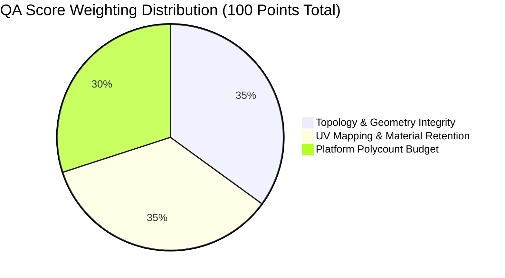
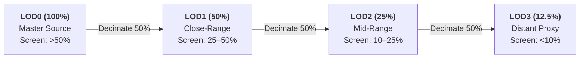

# Game-Ready Asset Specification & Measurable QA Criteria

## 1. Platform Triangle Budgets

Game-ready assets must meet strict polygon budgets depending on the target deployment platform:

| Platform | Target Triangle Budget | Max Vertices | Draw Calls | Recommended Use Case |
|---|---|---|---|---|
| **Mobile** | ≤ 18,000 | ~10,000 | 1–2 | Mobile WebGL, iOS/Android games, XR headsets |
| **Low** | ≤ 28,000 | ~16,000 | 1–2 | Low-end PC, Nintendo Switch, background props |
| **Medium** | ≤ 45,000 | ~25,000 | 1–3 | Standard PC/Console games, hero props, web interactive |
| **High** | ≤ 85,000 | ~50,000 | 1–4 | High-end PC/Console hero characters, Unreal Engine 5 |
| **Cinematic** | ≤ 180,000 | ~100,000 | 1–5 | Pre-rendered cinematics, virtual production |

---

## 2. Measurable QA Scoring Methodology (0–100)

### A. Topology & Geometry Integrity (35 Points Max)
- **Base Non-Zero Geometry**: +15 pts (Mesh contains verified non-zero faces and vertices).
- **Consistent Normal Winding**: +10 pts (All face normals point coherently outward).
- **Watertight Manifoldness**: +5 pts (No unclosed boundary holes or non-manifold edge manifolds).
- **Connected Component Cleanliness**: +5 pts (≤ 4 connected anatomical components; penalties applied if > 15 components).

### B. UV Mapping & Material Retention (35 Points Max)
- **Valid UV Mapping**: +20 pts (Mesh has valid non-overlapping UV coordinates in [0, 1] range).
- **Embedded PBR / Albedo Texture**: +15 pts (Mesh carries a baseColorTexture or material image).

### C. Platform Budget Compliance (30 Points Max)
- **Within Target Budget (≤ 1.0x)**: +30 pts.
- **Moderate Overage (1.0x – 1.5x)**: +20 pts.
- **Substantial Overage (1.5x – 2.5x)**: +10 pts.
- **Extreme Overage (> 2.5x)**: +5 pts.

---

## 3. Status Classification
- **PASS (Score ≥ 80)**: Asset is fully compliant for direct import into game engines.
- **WARN (Score 50–79)**: Asset is usable but has non-critical warnings.
- **FAIL (Score < 50)**: Asset requires repair or re-generation.

---

## 4. Multi-Tier LOD Cascade Standards

| Level | Budget Ratio | Description | Intended Screen Size |
|---|---|---|---|
| **LOD0** | 100% (Master) | Full-fidelity master model | > 50% screen height |
| **LOD1** | 50% of LOD0 | Close-range game variant | 25% – 50% screen height |
| **LOD2** | 25% of LOD0 | Medium-range game variant | 10% – 25% screen height |
| **LOD3** | 12.5% of LOD0 | Distant silhouette proxy | < 10% screen height |

---

## 5. Component Preservation Guard

The Safe Component Guard preserves anatomical features based on size thresholds:

| Component Type | Minimum Threshold | Behavior |
|---|---|---|
| Ears, Horns, Tails | ≥ 0.5% of vertices | Preserved if above threshold |
| Claws, Spikes | ≥ 15 vertices | Preserved if above threshold |
| Small accessories | ≥ 0.5% of vertices | Preserved |
| Floating noise islands | < 0.05% area AND < 5 tris | Purged |

---

## 6. Export Quality Tiers

| Quality Setting | Voxel Grid | Inference Steps | Target Polycount | Use Case |
|---|---|---|---|---|
| **Low** | 256³ | 20 steps | ~18k tris | Fast preview |
| **Medium** | 384³ | 35 steps | ~30k tris | Balanced workflow |
| **High** | 512³ | 50 steps | ~60k tris | Detailed production |
| **Ultra** | 640³ | 75 steps | ~100k tris | Maximum fidelity |
| **Raw** | 640³ | Full poly | Native density | Unoptimized master |
