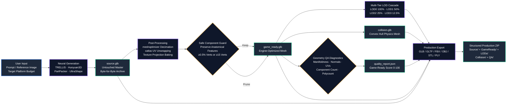

# 🧭 ForMash 3D — Product Vision & Architectural North Star

> *"The user provides the idea. ForMash 3D handles the technical 3D production work."*

---

## 🎯 Executive Vision

**ForMash 3D** is an automated, local AI 3D asset factory. It bridges state-of-the-art open-source generative 3D models (**TRELLIS**, **Hunyuan3D-2.1**, **PartPacker**, **UltraShape**) with an intelligent post-processing pipeline inspired by the workflow simplicity of modern 3D creation platforms (e.g., Tripo, Meshy AI; independently developed without affiliation, endorsement, or sponsorship), running locally and transparently on your own hardware.

### The Paradigm Shift
- **What ForMash 3D is NOT**: A simplistic demo wrapper that executes a single generation step.
- **What ForMash 3D IS**: An end-to-end 3D production pipeline that takes an image or prompt and automatically produces the highest-quality practical 3D asset possible, processes it intelligently, validates it, optimizes it, and gives the user a usable game-ready result.

---

## 🛡️ The Foundational Product Principles

### 1. Quality First
Generated models must look as good as the selected AI model can realistically produce.
- Never degrade a high-fidelity AI-generated result through careless post-processing.
- If a post-processing step reduces quality, preserve the better version.

### 2. Automation First
A normal creator should not need to understand retopology, UV unwrapping, normal baking, decimation ratios, collision decomposition, or export format specifications.
- High-level choices (Target Platform: Mobile, PC/Console, Cinematic) drive the underlying engineering.
- The pipeline executes technical decisions autonomously.

### 3. Intelligent Processing
Analyze before acting:
- **Component Guard**: If generated mesh has clean topology, preserve all components above the threshold (≥0.5% vertices or ≥15 verts).
- **UV Preservation**: If valid texture coordinates exist, preserve them. Parameterize via xatlas only when UVs are missing/corrupted.
- **Detail Guard**: If decimation would exceed geometric error thresholds, clamp reduction.

### 4. Master Asset Preservation
The raw AI generation output (`source.glb`) is immutable and sacred:
- Saved immediately upon generation before any post-processing runs.
- Derived assets (`game_ready.glb`, `lods/`, `collision.glb`) are saved distinctly and never overwrite the master.

### 5. Game-Ready Output
For supported assets, ForMash 3D automatically delivers:
- Clean geometry with recalculated, consistent face normals.
- Valid UV coordinates with preserved PBR textures.
- Optimized polycounts tailored to target engine budgets.
- Strictly monotonic LOD cascades (LOD0 → LOD1 → LOD2 → LOD3).
- Simplified, watertight collision hulls.

### 6. Honest Capabilities
The system never claims capabilities it cannot perform:
- **No fake rigging**: Armatures applied exclusively to verified humanoid bipeds.
- **No fake QA scores**: The 0–100 score is computed from real topological measurements.
- **No fake formats**: All format conversions use real backend conversion routines.

### 7. Provider-Aware Design
Different neural architectures have unique strengths:
- **TRELLIS**: Structured FlexiCubes with native PBR materials.
- **Hunyuan3D-2.1**: Dense high-resolution shapes + dedicated paint pipeline.
- **PartPacker**: Fast single-image shape generation.
- **UltraShape**: Arbitrary-topology mesh reconstruction.

### 8. Production-Minded Architecture
ForMash 3D is a modular, enterprise-grade application:
- Built on proven primitives: FastAPI, Python 3.10 (Conda env `3daigc-api`), Pydantic V2, Next.js 16, Three.js, Bun.
- VRAM-aware multiprocess scheduling for safe GPU utilization.
- Optional Redis multi-worker queue for horizontal scaling.

### 9. Measurable Quality
A "Game Ready" label is never subjective. Backed by an explainable 0–100 composite rubric:
- **Topology & Geometric Integrity (35 pts)**: Manifoldness, normal winding, degenerate faces.
- **UV Mapping & Texture Integrity (35 pts)**: UV presence, atlas normalization, material binding.
- **Platform Budget & Transform Sanity (30 pts)**: Conformance to target triangle budget, non-zero bounding box.

### 10. Seamless User Experience
- The user selects: **Model**, **Quality**, **Target Output**, enters a prompt or drops an image.
- One click on **Generate** initiates the pipeline.
- The user receives an interactive 3D preview, measurable diagnostics, and a structured export bundle.

---

## 📦 Canonical Deliverable Layout

```mermaid
flowchart TB
    classDef dir fill:#1e293b,stroke:#3b82f6,stroke-width:2px,color:#fff
    classDef file fill:#0f172a,stroke:#64748b,stroke-width:1px,color:#cbd5e1
    classDef master fill:#0f172a,stroke:#ef4444,stroke-width:2px,color:#fff

    ZIP["Asset_Package.zip"]:::dir
    ZIP --> MODEL["Model/"]:::dir
    ZIP --> SOURCE["Source/"]:::dir
    ZIP --> LODS["LODs/"]:::dir
    ZIP --> COLLISION["Collision/"]:::dir
    ZIP --> PREVIEW["Preview/"]:::dir
    ZIP --> QA["QA/"]:::dir

    MODEL --> ASSET["Asset.glb<br/>Primary Game-Ready Asset"]:::file
    SOURCE --> MASTER["Asset_source.glb<br/>Preserved Raw AI Master"]:::master
    LODS --> L0["lod0.glb<br/>100% Fidelity"]:::file
    LODS --> L1["lod1.glb<br/>50% Decimation"]:::file
    LODS --> L2["lod2.glb<br/>25% Decimation"]:::file
    LODS --> L3["lod3.glb<br/>12.5% Proxy"]:::file
    COLLISION --> COLL["Asset_collision.glb<br/>Watertight Physics Collider"]:::file
    PREVIEW --> THUMB["thumbnail.png<br/>High-Res Asset Render"]:::file
    QA --> REPORT["quality_report.json<br/>Complete Diagnostic Metrics"]:::file

    style ZIP fill:#1e293b,stroke:#f59e0b
    style MASTER fill:#0f172a,stroke:#ef4444
```

> **Master Asset Preservation**: The raw generative master (`source.glb`) is archived before any post-processing. Derived operations never overwrite the source asset.

---

## 🚀 Guiding Compass for Future Engineering

> *"Does this make ForMash 3D feel more like an intelligent, automated 3D asset factory while preserving raw quality, truthfulness, and reliability?"*
