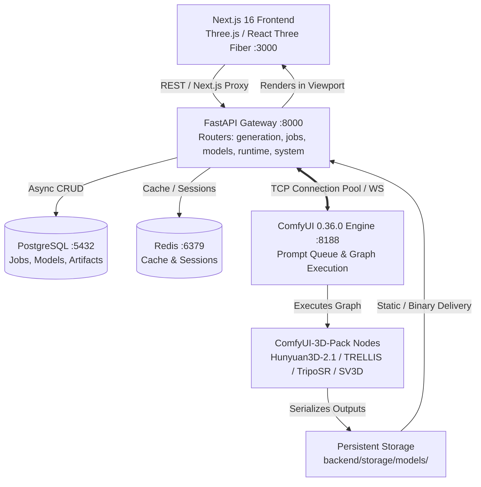
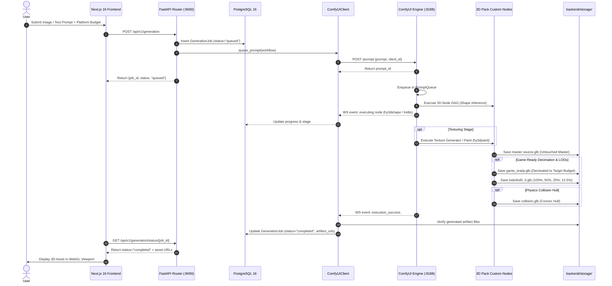

# 🏛️ AI 3D Studio — Complete System Architecture & Pipeline Blueprint

> **System Version**: 6.0.0 (ComfyUI Execution Core & ComfyUI-3D-Pack Integration)  
> **Target Deployments**: Single-GPU Linux / Google Colab (T4 15GB, V100 16GB, A100 40GB/80GB), Local Dev / Cloud Workstations  
> **Last Verified**: September 2026

---

## 1. Executive System Overview

AI 3D Studio is an end-to-end generative 3D reconstruction and asset optimization platform that converts 2D images or text prompts into game-ready 3D assets (`.glb`, `.obj`, `.fbx`, `.stl`, PBR textures, LOD cascades, collision hulls).

### Core Stack
* **Frontend**: Next.js 16 (React 19, TypeScript, Three.js, React Three Fiber, Tailwind CSS)
* **API Gateway**: FastAPI (Python 3.12, Pydantic V2, AsyncIO, SQLAlchemy 2.0)
* **Execution Core**: **ComfyUI 0.36.0** (`ENGINE/ComfyUI`) — Prompt Queue, WebSocket streaming, computational DAG execution
* **3D Node Layer**: **ComfyUI-3D-Pack** (`ENGINE/ComfyUI/custom_nodes/ComfyUI-3D-Pack`) — Hunyuan3D-2.1, TRELLIS, TripoSR, TripoSF, SV3D
* **Database & Cache**: PostgreSQL 16 (persistent jobs and metadata) + Redis (caching and sessions)
* **Quality Engine**: Blender 4.x (headless) & Trimesh (safe decimation, LOD0–LOD3 cascade, physics convex hulls, 0–100 QA rubric)



---

## 2. End-to-End Generation Lifecycle

When a user submits an image-to-3D or text-to-3D job, the request traverses the following sequence:



---

## 3. High-Throughput & Low-Latency Performance Architecture

The architecture enforces strict performance invariants across all layers:

### 3.1 ComfyUI Engine Invariants
1. **Response Body Compression (`--enable-compress-response-body`)**: Eliminates network bloat when transmitting JSON schemas and status responses.
2. **mmap Safetensors (`--mmap-torch-files`)**: Checks and weights are memory-mapped directly from filesystem pages, cutting model load times and RAM pressure.
3. **Split Cross-Attention (`--use-split-cross-attention`)**: Enables efficient chunked attention matrices for CPU fallback runs without requiring CUDA.
4. **Async Offloading (`--async-offload 2`)**: Uses 2 independent CUDA streams on GPU systems to overlap weight transfers and tensor execution.

### 3.2 Gateway Client Invariants
1. **Reusable Connection Pooling**: All HTTP requests between FastAPI and ComfyUI use a shared `aiohttp.TCPConnector(limit=100, keepalive_timeout=60.0)` to eliminate per-request TCP handshakes.
2. **Micro-Caching**: Endpoint `/system_stats` is micro-cached for 3.0s in memory, enabling high-frequency polling from frontend status bars without overloading the engine.
3. **In-Memory Node Info Cache**: ComfyUI `/object_info` (which returns specifications for all registered nodes) is cached after first fetch.
4. **Targeted VRAM Clearing**: Endpoint `POST /api/v1/runtime/clear-vram` calls ComfyUI's `/free` endpoint with `{"unload_models": False, "free_memory": True}`, purging intermediate activation caches while keeping loaded neural model weights hot.

---

## 4. Multi-Format Asset Packaging & Delivery

The production export engine (`POST /api/v1/project/export`) packages generated assets into industry-standard formats:

| Format | Target Software / Engine | Pipeline Stage | PBR Support |
|---|---|---|---|
| **GLB** | WebGL, Three.js, Godot 4, Babylon.js | Direct glTF 2.0 Binary | Complete PBR (Roughness/Metallic/Normal) |
| **FBX** | Unreal Engine 5, Unity, Maya, 3ds Max | Headless Blender Exporter | Skeletal Armature + PBR Shaders |
| **OBJ** | Wavefront, ZBrush, Cinema4D | Trimesh / Blender OBJ | Geometry + MTL Material Lib |
| **STL** | 3D Printing, CAD, Slicers | Trimesh Watertight Exporter | Pure Surface Geometry |

Production ZIP bundles maintain this standard directory structure:
```
Project_Export_<job_id>.zip
├── Source/
│   └── source.glb              # Original byte-for-byte neural output
├── GameReady/
│   └── game_ready.glb          # Engine-compliant decimated mesh
├── LODs/
│   ├── lod0.glb                # 100% triangles (Master baseline)
│   ├── lod1.glb                # 50% triangles (Mid distance)
│   ├── lod2.glb                # 25% triangles (Long distance)
│   └── lod3.glb                # 12.5% triangles (Proxy geometry)
├── Collision/
│   └── collision.glb           # Watertight physics convex hull
└── QA/
    └── quality_report.json     # Topology validation score (0-100)
```

---

## 5. Verification Matrix & Health Check

Automated self-check command:
```bash
python3 backend/tests/test_backend_e2e.py
```

Expected output:
```text
Running AI Studio Backend E2E Validation...
[PASS] Configuration check
[PASS] Database CRUD check
[PASS] ComfyUI connection check (ComfyUI version: 0.36.0)
[PASS] Workflow manager check
[PASS] Model registry check (5 models verified)
All backend checks PASSED successfully!
```
