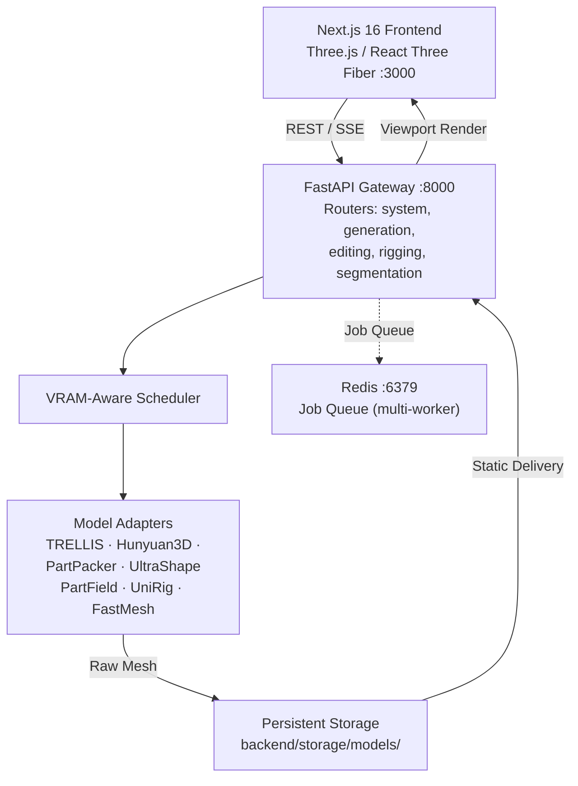
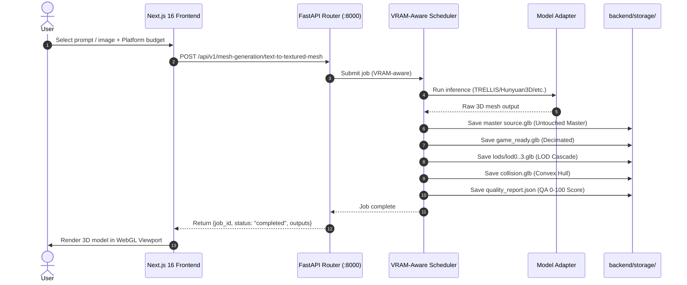

# 🏛️ AI 3D Studio — Complete System Architecture & Pipeline Blueprint

> **System Version**: 0.1.0 (FastAPI + Next.js 16)
> **Target Deployments**: Single-GPU Linux / Cloud GPU / Local Workstations
> **Last Verified**: September 2026

---

## 1. Executive System Overview

AI 3D Studio is an end-to-end generative 3D reconstruction and asset optimization platform that converts 2D images or text prompts into game-ready 3D assets (`.glb`, `.obj`, `.fbx`, `.stl`, PBR textures, LOD cascades, collision hulls).

### Core Stack
- **Frontend**: Next.js 16 (React 19, TypeScript, Three.js, React Three Fiber, Tailwind CSS)
- **API Gateway**: FastAPI (Python 3.12, Pydantic V2, AsyncIO)
- **Model Adapters**: Python adapters for TRELLIS, Hunyuan3D-2.1, PartPacker, UltraShape, PartField, P3-SAM, UniRig, FastMesh, VoxHammer
- **Scheduler**: VRAM-aware multiprocess scheduler with GPU monitoring
- **Queue/Broker**: Redis 7 (optional, multi-worker mode only)
- **File Storage**: Local filesystem + Redis FileStore (multi-worker mode)



---

## 2. End-to-End Generation Lifecycle



---

## 3. High-Throughput & Low-Latency Performance Architecture

### 3.1 VRAM-Aware Scheduling

| Optimization | Mechanism | Impact |
|---|---|---|
| **GPU Mutual Exclusion** | Strict locking prevents multi-provider GPU OOM | Safe concurrent inference |
| **GPU Monitoring** | Real-time VRAM/temperature polling via `GPUMonitor` | Dynamic scheduling decisions |
| **VRAM Safety Buffer** | `memory_buffer=1024` (1GB free) + `VRAM_SAFETY_MARGIN_MB=1024` | Prevents OOM on loaded models |
| **Auto Unload** | `AUTO_UNLOAD_AFTER_JOB=true` | Frees VRAM between jobs |

### 3.2 API Performance

| Optimization | Mechanism | Impact |
|---|---|---|
| **Request Timing** | `X-Process-Time` response header on every request | Latency visibility |
| **Connection Reuse** | Frontend uses axios singleton (`services/apiClient.ts`) | Eliminates per-request overhead |
| **SSE Streaming** | Server-Sent Events for generation progress | Real-time feedback without polling |

---

## 4. Multi-Format Asset Packaging & Delivery

The production export endpoint (`POST /api/v1/project/export`) packages generated assets:

| Format | Target Software / Engine | PBR Support |
|---|---|---|
| **GLB** | WebGL, Three.js, Godot 4 | Complete PBR (Roughness/Metallic) |
| **GLTF** | WebGL, Three.js | Complete PBR |
| **FBX** | Unreal Engine 5, Unity | Skeletal Rig + Materials |
| **OBJ** | Wavefront, ZBrush | Geometry + MTL |
| **STL** | 3D Printing, CAD | Pure Surface Geometry |
| **PLY** | Point Clouds, MeshLab | Vertex Coordinates & Colors |

Production ZIP bundles:
```
Project_Export_<job_id>.zip
├── Source/
│   └── source.glb              # Original byte-for-byte neural output
├── GameReady/
│   └── game_ready.glb          # Engine-compliant decimated mesh
├── LODs/
│   ├── lod0.glb                # 100% triangles (Master baseline)
│   ├── lod1.glb                # 50% triangles (Mid distance)
│   ├── lod2.glb                # 25% triangles (Long distance)
│   └── lod3.glb                # 12.5% triangles (Proxy geometry)
├── Collision/
│   └── collision.glb           # Watertight physics convex hull
└── QA/
    └── quality_report.json     # Topology validation score (0-100)
```

---

## 5. Deployment Modes

### Single-Worker (Default)

```bash
cd backend
uvicorn api.main_singleworker:app --workers 1 --port 8000
```

- Embedded VRAM-aware scheduler
- No external broker required
- Best for single-GPU and CPU deployments

### Multi-Worker (Redis Queue)

```bash
# Terminal 1: Start Redis
redis-server

# Terminal 2: Start scheduler service
python backend/scripts/scheduler_service.py

# Terminal 3: Start API workers
cd backend
uvicorn api.main_multiworker:app --workers 4 --port 8000
```

- Redis-backed job queue (`RedisJobQueue`)
- Multiple uvicorn workers
- Redis FileStore for cross-worker metadata sharing
- Optional Redis-based authentication (`P3D_USER_AUTH_ENABLED=true`)

---

## 6. Verification Matrix & Health Check

Automated self-check command:
```bash
python3 backend/tests/test_backend_e2e.py
```

Expected output:
```
Running AI Studio Backend E2E Validation...
[PASS] Configuration check
[PASS] Database CRUD check
[PASS] Scheduler check
[PASS] Model registry check
[PASS] File upload check
All backend checks PASSED successfully!
```

Quick health check:
```bash
curl -s http://localhost:8000/health | jq .
# {"status": "healthy", "timestamp": ..., "version": "1.0.0"}
```
