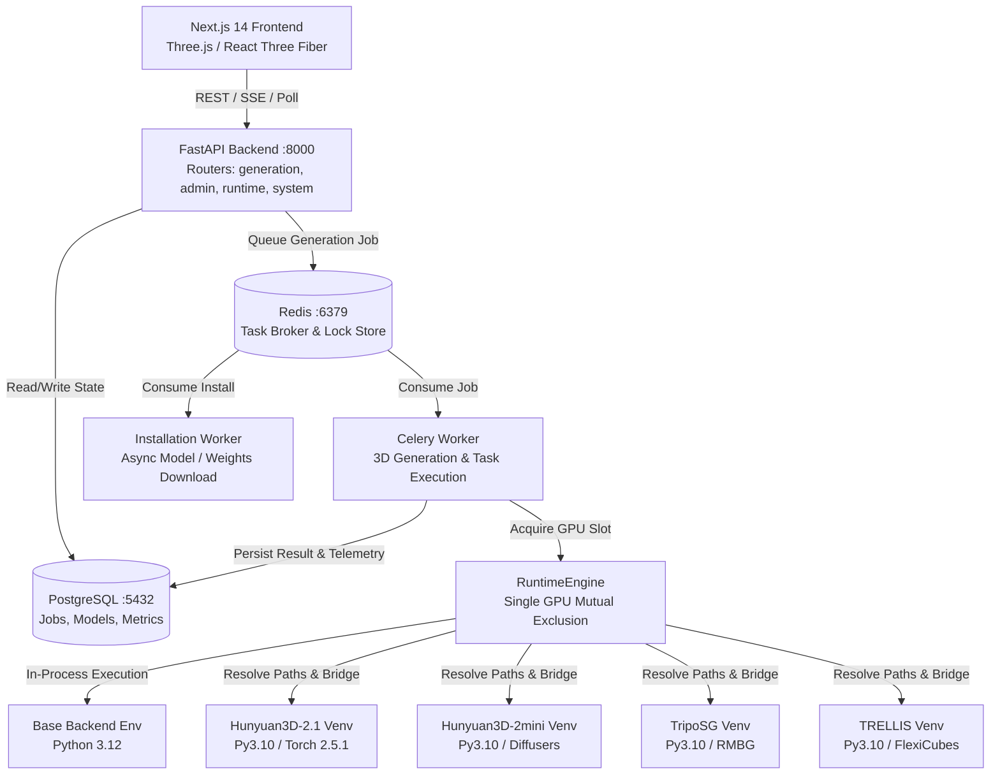
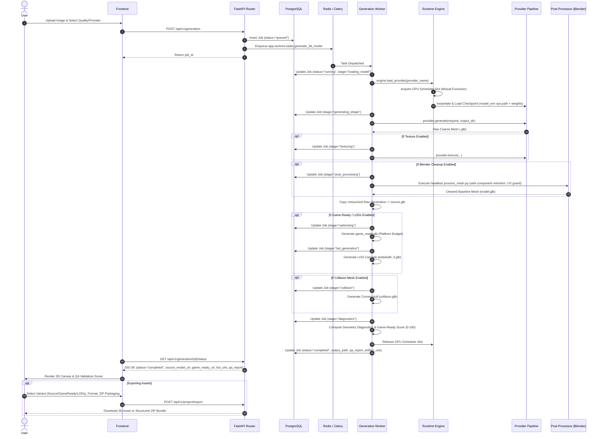
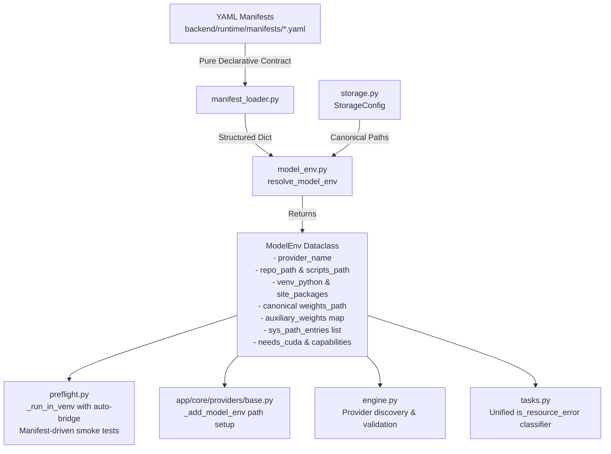
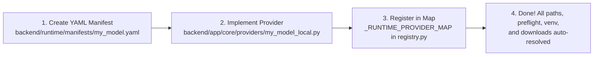
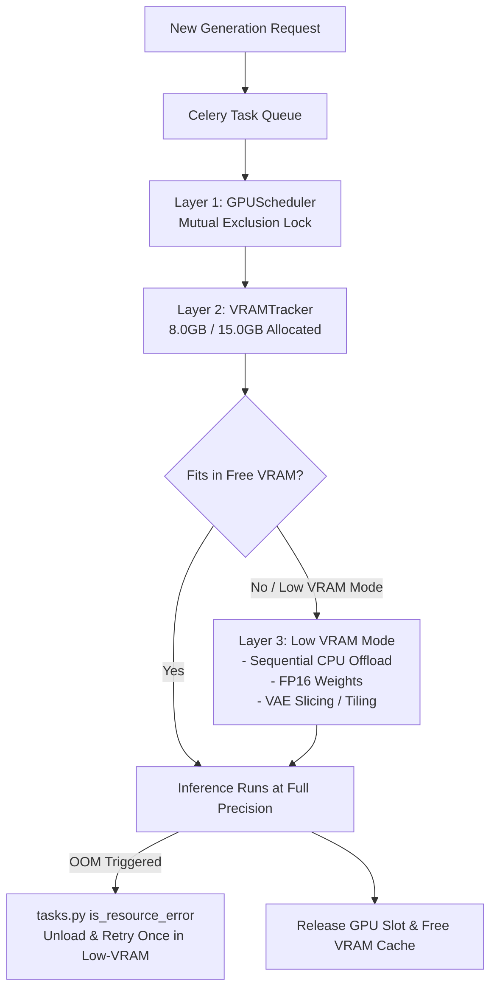

# 🏛️ AI 3D Studio — Complete System Architecture & Pipeline Blueprint

> **System Version**: 5.0.0 (Unified Model Environment & Manifest-Driven Engine)  
> **Target Deployments**: Single-GPU Linux / Google Colab (T4 15GB, V100 16GB, A100 40GB/80GB), Local Dev / Cloud Instances  
> **Last Verified**: September 2026

---

## 1. Executive System Overview

AI 3D Studio is an end-to-end generative 3D mesh reconstruction platform that takes 2D images or text prompts and outputs production-grade 3D assets (`.glb`, `.obj`, textures, PBR maps, vertex colors).

### Core Stack
* **Frontend**: Next.js 14 (TypeScript, React Three Fiber, Three.js, TailwindCSS)
* **API Backend**: FastAPI (Python 3.12, Pydantic V2, AsyncIO, SQLAlchemy)
* **Task Queue**: Celery with Redis (Async generation, model download workers, health monitors)
* **Database**: PostgreSQL with asyncpg (Jobs, model records, system telemetry)
* **Inference Runtime**: Custom per-model virtual environment manager (`backend/runtime/`) with isolated ABI dependencies and dynamic VRAM arbitration.



---

## 2. End-to-End Generation Lifecycle

When a user submits an image-to-3D or text-to-3D job, the request traverses six isolated stages:



---

## 3. The Unified Model Environment Architecture (`model_env.py`)

### The Problem It Solved
In earlier versions, each subsystem implemented its own paths, import chains, numpy bridges, and error classifications. This caused frequent `state=blocked` errors when adding or running models.

### The Unified Flow
`model_env.py` serves as the **single source of truth** between YAML manifests and Python code:



### Key Components of `model_env.py`

| Component | Signature | Role |
|---|---|---|
| **`resolve_model_env`** | `(provider_name: str) -> ModelEnv \| None` | Pure resolver: extracts paths, scripts, venvs, and weights from YAML. |
| **`apply_numpy_bridge`** | `() -> None` | In-process bridge for NumPy 1.26.x `_core` $\leftrightarrow$ `core` compatibility. |
| **`get_numpy_bridge_code`** | `() -> str` | Injectable Python preamble for all venv subprocess runs. |
| **`is_resource_error`** | `(text: str) -> bool` | Unified classifier for GPU OOM, CUDA unavailable, driver timeout, etc. |
| **`run_in_model_venv`** | `(provider, code, venv_py, timeout) -> (int, str)` | Subprocess runner with auto-injected sys.path and numpy bridge. |

---

## 4. Supported 3D Providers & Capabilities Matrix

| Provider Key | Primary Weight Repo | Target Repo | Min VRAM | Supported Modes | Native Extensions |
|---|---|---|---|---|---|
| **`hunyuan3d-2.1`** | `tencent/Hunyuan3D-2.1` | `Hunyuan3D-2.1` | 10 GB (8 GB low) | Text-to-3D, Image-to-3D, Texture/PBR | `cupy-cuda12x` (optional) |
| **`hunyuan3d-2-mini`** | `tencent/Hunyuan3D-2mini` | `Hunyuan3D-2mini` | 4 GB (4 GB low) | Image-to-3D, Optional Texture | None (pure PyTorch DiT) |
| **`trellis`** | `microsoft/TRELLIS-image-large` | `TRELLIS` | 8 GB (6 GB low) | Image-to-3D, Texture | `FlexiCubes` |
| **`triposg`** | `VAST-AI/TripoSG` | `TripoSG` | 8 GB (8 GB low) | Image-to-3D | `diso` (optional) |
| **`triposr`** | `stabilityai/TripoSR` | `TripoSR` | 6 GB (4 GB low) | Image-to-3D, Texture/PBR | `torchmcubes` |
| **`triposf`** | `VAST-AI/TripoSF` | `TripoSF` | 12 GB | Remesh, Mesh Reconstruction | `spconv`, `torch-scatter` |
| **`ardy`** | `nvidia/ARDY-Core-RP-20FPS-Horizon40` | `Ardy` | 12 GB (8 GB low) | Animation, Humanoid Motion (.npz) | None |
| **`detailgen3d`** | `VAST-AI/DetailGen3D` | `DetailGen3D` | 4 GB | Remesh, Detail Enhancement | `diso`, `torch-cluster` |
| **`mock`** | Built-in Procedural | None | 0 MB | All Modes (CI / CPU Testing) | None |

---

## 5. Storage Directory & Path Conventions

The platform enforces a strict **per-model canonical storage layout**:

```
backend/
├── third_party/
│   ├── Hunyuan3D-2.1/
│   │   ├── .venv/                      <-- Isolated per-model venv (Py3.10)
│   │   ├── weights/hunyuan3d-2.1/      <-- Canonical model weights
│   │   └── scripts/
│   ├── Hunyuan3D-2mini/
│   │   ├── .venv/
│   │   ├── weights/hunyuan3d-2-mini/   <-- DiT & VAE checkpoints
│   │   └── scripts/
│   ├── TripoSG/
│   │   ├── .venv/
│   │   ├── weights/triposg/            <-- TripoSG weights
│   │   └── weights/briaai/RMBG-1.4/    <-- Canonical auxiliary weights
│   ├── TripoSR/
│   │   ├── .venv/
│   │   └── weights/triposr/            <-- StabilityAI TripoSR weights
│   ├── TripoSF/
│   │   ├── .venv/
│   │   └── weights/triposf/            <-- VAST SparseFlex weights
│   ├── Ardy/
│   │   ├── .venv/
│   │   └── weights/ardy/               <-- NVIDIA ARDY checkpoints
│   ├── TRELLIS/
│   │   ├── .venv/
│   │   └── weights/trellis/
│   ├── .hf_cache/                      <-- Shared download scratchpad (transient)
│   └── weights/                        <-- Centralized legacy folder (deprecated)
```

### Weight Resolution Hierarchy
When `storage.get_weight_path(key)` is invoked:
1. **Per-Model Canonical**: `third_party/<repo>/weights/<key>` (Highest priority)
2. **Per-Model Flat**: `third_party/<repo>/weights/`
3. **Auxiliary Discovery**: Recursive scan of `third_party/**/weights` for auxiliary keys (e.g. `RMBG-1.4`)
4. **Legacy Centralized**: `third_party/weights/<key>` (Read-only fallback for older setups)
5. **HF Cache Snapshots**: `third_party/.hf_cache/hub/models--.../snapshots/`

---

## 6. How to Add a New 3D Model (Zero-Code Manifest Workflow)

Adding any new generative 3D model now requires only **1 YAML file** and **1 provider class**:



### Step 1: Create Manifest (`backend/runtime/manifests/my_model.yaml`)
```yaml
name: my-new-model
label: My New 3D Model
source:
  repo: https://github.com/my-org/my-model.git
  ref: main
  local_dir: MyNewModel
environment:
  python: '3.10'
  torch: 2.5.1
dependencies:
  python:
    - diffusers
    - transformers
    - accelerate
  imports:
    - torch
    - diffusers
weights:
  primary:
    repo: my-org/my-model-weights
hardware:
  minimum_vram_mb: 8192
capabilities:
  shape:
    enabled: true
    native_build_required: false
preflight:
  check_model_venv: true
  import_packages: [torch, diffusers]
  check_weights: true
  check_cuda: true
  smoke_inference: true
  smoke_inference_code: |
    import torch
    print("ok")
```

### Step 2: Implement Provider Class
```python
from app.core.providers.base import BaseProvider, ProviderResult, _add_model_env
from runtime.model_env import resolve_model_env

class MyNewModelProvider(BaseProvider):
    @property
    def name(self) -> str:
        return "my-new-model"

    def __init__(self, device: str = "cuda:0", low_vram: bool = False):
        _add_model_env("MyNewModel")
        env = resolve_model_env("my-new-model")
        self.weights_path = env.weights_path

    async def generate(self, request, output_dir, progress_callback=None):
        # Inference logic here
        ...
```

### Step 3: Register Provider in `registry.py`
Add one line to `_RUNTIME_PROVIDER_MAP` in `backend/app/core/providers/registry.py`:
```python
"my-new-model": ("app.core.providers.my_model_local", "MyNewModelProvider"),
```

---

## 7. Memory & VRAM Arbitration Architecture

On consumer or shared GPUs (like Google Colab's 15GB T4), running multiple large diffusion pipelines simultaneously will cause an immediate Out-Of-Memory (OOM) crash.

AI 3D Studio prevents this via **3 cooperative layers**:



1. **`_GPUScheduler` (Mutual Exclusion Lock)**: Only one provider holds the GPU execution slot at any given moment. Sibling tasks queue asynchronously in Celery.
2. **`VRAMTracker`**: Proactively tracks allocated and reserved VRAM in gigabytes before loading model checkpoints into PyTorch.
3. **Automatic Low-VRAM Fallback**: If an unhandled CUDA OOM occurs during generation, `tasks.py` detects it via `is_resource_error()`, purges CUDA cache (`torch.cuda.empty_cache()`), and automatically restarts inference with `low_vram=True`.

---

## 8. Verification & Self-Check Runbook

To verify system readiness at any time:

```bash
# 1. Run all 10 model environment & compatibility self-checks
python3 backend/app/core/providers/test_model_readiness_numpy.py

# 2. Verify dependency manifest contract
python3 backend/runtime/test_dependency_manifest_contract.py

# 3. Check installation state of all providers via API
curl http://localhost:8000/api/v1/admin/providers

# 4. Verify 3D Quality Pipeline & Export Integration
python3 scripts/test_pipeline_and_export.py
```

---

## 9. Frontend Studio Architecture & Acceleration

The Next.js 16 App Router interface is designed for real-time 3D generation, animation, and asset management:

### 1. Dual-Scope Navigation Rail
- **Studio Views**: Full-page administrative and library hubs (`Overview`, `Assets`, `System`). Docked cleanly at `md:left-[72px]`.
- **3D Generation Tools**: Contextual interactive overlays (`Model`, `Poly`, `Texture`, `Animate`, `Segment`) with stateful properties inspector.
- **Top Header Tabs**: Animated layout pill indicator (`motion/react` `layoutId="topNavActiveIndicator"`) providing instant, fluid route transitions between Home, 3D Studio, Animation & Rigging, Assets, and System telemetry.

### 2. Multi-Modal Generation Inputs (`GeneratePanel.tsx`)
- **Single Image Mode (`subAction === 'image'`)**: Clean drag-and-drop reference image upload with sample loader.
- **Multi-View 4-Angle Mode (`subAction === 'crop'`)**: 4 orthogonal perspective capture slots (`Front*`, `Right`, `Back`, `Left`) synchronized with `generationSettings.multiviewImages`.
- **Text-to-3D Workshop (`subAction === 'wand'`)**: Direct prompt engineering with "Inspire Me" / Roll Random Idea generation and collapsible Negative Prompt configuration.
- **2D Concept Sketchpad Canvas (`subAction === 'edit'`)**: Interactive HTML5 drawing pad with brush/eraser, custom color palette, and direct "Use as 3D Reference" pipeline integration.

### 3. Server-Side Rendering (SSR) Acceleration
- **Dynamic Bailout Elimination**: Standard panels render with direct imports instead of `next/dynamic` with `ssr: false`, ensuring instantaneous First Contentful Paint (FCP) and seamless hydration.
- **Strict Client Boundaries**: Root App Router pages maintain clean `'use client'` wrappers to protect client-only Three.js and state contexts while streaming static markup.

