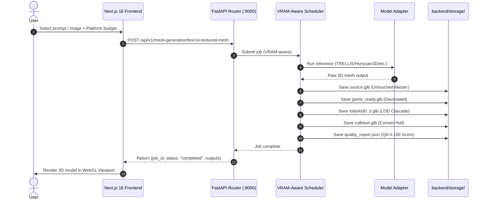
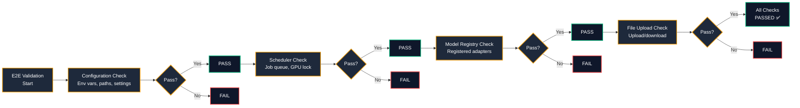

# AI 3D Studio — System & Runtime Architecture

> **Architecture Version**: 0.1.0 (FastAPI + Next.js 16)  
> **Last Verified**: September 2026  
> **Target Environments**: Linux (Ubuntu 20.04/22.04/24.04), Google Colab (T4, V100, L4, A100), Cloud GPU / Local Workstations

---

## 1. Architectural Mission & Overview

AI 3D Studio is an end-to-end generative 3D asset pipeline. The system is architected around a clean separation of concerns:
- **Presentation Layer**: Next.js 16 frontend with interactive Three.js 3D viewport, Tripo-style tooling, and model management.
- **API Gateway**: FastAPI backend with VRAM-aware multiprocess scheduler, request validation, rate limiting, and static file delivery.
- **Model Adapters**: Python adapters for each AI model (TRELLIS, Hunyuan3D, PartPacker, UltraShape, PartField, P3-SAM, UniRig, FastMesh, VoxHammer).
- **Scheduler**: VRAM-aware scheduler with GPU monitoring and optional Redis multi-worker queue.

```mermaid
flowchart TB
    classDef layer fill:#0f172a,stroke:#64748b,stroke-width:1px,color:#94a3b8
    classDef node fill:#1e293b,stroke:#3b82f6,stroke-width:2px,color:#fff
    classDef db fill:#1e293b,stroke:#ec4899,stroke-width:2px,color:#fff
    classDef store fill:#1e293b,stroke:#10b981,stroke-width:2px,color:#fff

    subgraph LAYER["Frontend Layer"]
        direction TB
        NEXT["Next.js 16 :3000<br/>React 19 + TypeScript"]:::node
        VPORT["3D Viewport<br/>Three.js / R3F"]:::node
        CONTROLS["Generation Controls<br/>LOD / Budget / Export"]:::node
    end

    subgraph GW["API Gateway Layer"]
        direction TB
        API["FastAPI Gateway :8000<br/>Routers + CORS + Rate Limit"]:::node
        ROUTERS["API Routers<br/>system · file-upload<br/>mesh-generation · mesh-editing<br/>auto-rigging · mesh-segmentation<br/>mesh-retopology · mesh-uv-unwrapping<br/>users"]:::node
        SCHED["VRAM-Aware Scheduler<br/>GPU Mutual Exclusion"]:::node
        STATIC["Static File Delivery<br/>/static Binary Streaming"]:::node
    end

    subgraph CORE["Model Execution Layer"]
        direction TB
        ADAPTERS["Model Adapters<br/>TRELLIS · Hunyuan3D · PartPacker<br/>UltraShape · PartField · UniRig<br/>FastMesh · VoxHammer"]:::node
        GPU_MON["GPU Monitor<br/>VRAM / Temperature"]:::node
        VRAM_BUF["VRAM Safety Buffer<br/>1GB Free Margin"]:::node
    end

    subgraph DATA["Storage Layer"]
        direction TB
        FILESTORE["Redis FileStore<br/>Cross-Worker Metadata"]:::store
        LOCAL["Local Filesystem<br/>backend/storage/models/<job_id>/"]:::store
        UPLOADS["Upload Bucket<br/>backend/storage/uploads/"]:::store
        EXPORTS["Export Archives<br/>backend/storage/exports/"]:::store
    end

    subgraph OPT["Optional Services"]
        direction TB
        REDIS["Redis 7 :6379<br/>Multi-Worker Queue"]:::db
    end

    LAYER -->|"REST / SSE / WS"| GW
    API --> ROUTERS
    API --> SCHED
    SCHED --> ADAPTERS
    SCHED --> GPU_MON
    SCHED --> VRAM_BUF
    ADAPTERS -->|Raw Mesh| DATA
    SCHED --"Job Queue"| OPT
    STATIC -->|"Binary Delivery"| LAYER

    style LAYER fill:#0f172a
    style GW fill:#0f172a
    style CORE fill:#0f172a
    style DATA fill:#0f172a
    style OPT fill:#0f172a
```

---

## 2. Component Layers

### 2.1 Presentation Layer (Next.js 16)

| Component | Path | Description |
|---|---|---|
| **App Router** | `app/` | Next.js 16 App Router with server components, layouts, and API proxy routes |
| **Workspace Shell** | `features/workspace/WorkspaceShell.tsx` | Main workspace UI with tabbed panels and model viewport |
| **API Client** | `services/apiClient.ts` | Unified axios client for all FastAPI backend REST/SSE communication |
| **3D Canvas** | `components/viewport/` | Three.js WebGL viewport with orbit controls, wireframe mode, matcap shading |
| **State Stores** | `stores/` | Zustand stores for global client state (`useAppStore`, `useViewerStore`) |
| **Data Fetching** | hooks + TanStack Query | Server-state caching and synchronization for job status |

### 2.2 API Gateway Layer (FastAPI)

Located at `backend/api/`:
- **Entry Points**: `main_singleworker.py` (embedded scheduler) and `main_multiworker.py` (Redis queue).
- **API Routers**: REST controllers for system info, file upload, mesh generation/editing, auto-rigging, segmentation, retopology, UV unwrapping, and user management.
- **Configuration** (`backend/core/config.py`): Pydantic V2 settings loaded from `.env` and YAML config files (`system.yaml`, `models.yaml`).
- **Static File Server**: Optimized binary streaming for 3D formats (`.glb`, `.gltf`, `.fbx`, `.obj`, `.stl`) with cache headers.
- **Auth Service** (`backend/core/auth/`): Optional Redis-based authentication controlled by `P3D_USER_AUTH_ENABLED`.

### 2.3 Model Execution Layer

| Component | Path | Description |
|---|---|---|
| **Scheduler Factory** | `backend/core/scheduler/scheduler_factory.py` | Creates dev/prod scheduler instances |
| **Multiprocess Scheduler** | `backend/core/scheduler/multiprocess_scheduler.py` | VRAM-aware scheduler with GPU mutual exclusion |
| **GPU Monitor** | `backend/core/scheduler/gpu_monitor.py` | Real-time VRAM and temperature polling |
| **Job Queue** | `backend/core/scheduler/job_queue.py` | Job request models and types |
| **Redis Job Queue** | `backend/core/scheduler/redis_job_queue.py` | Redis-backed distributed job queue (multi-worker) |
| **Model Adapters** | `backend/adapters/` | Python inference adapters for each model |

### 2.4 Storage Layer

Located at `backend/storage/`:
- **Uploads** (`uploads/`): User-uploaded reference images (`.png`, `.jpg`, `.webp`).
- **Models** (`models/<job_id>/`): Generated 3D assets organized per job.
- **Thumbnails** (`thumbnails/`): Rendered asset preview images.
- **Exports** (`exports/`): Structured ZIP packages for engine delivery.

---

## 3. Performance Optimizations

| Optimization | Target Layer | Mechanism | Impact |
|---|---|---|---|
| **GPU Mutual Exclusion** | Scheduler | Strict process locking | Prevents GPU OOM during concurrent inference |
| **GPU Monitoring** | Scheduler | Real-time VRAM/temperature polling | Dynamic scheduling decisions |
| **VRAM Safety Buffer** | Scheduler | `VRAM_SAFETY_MARGIN_MB=1024` | Ensures 1GB free margin after each job |
| **Auto Unload** | Scheduler | `AUTO_UNLOAD_AFTER_JOB=true` | Frees VRAM between jobs |
| **Connection Reuse** | Frontend | Axios singleton (`services/apiClient.ts`) | Eliminates per-request overhead |
| **SSE Streaming** | API Gateway | Server-Sent Events for progress | Real-time feedback without polling |

---

## 4. End-to-End Generation Request Flow



---

## 5. Storage Directory Organization

All user assets and generation outputs are stored under `backend/storage/`:

```mermaid
flowchart LR
    classDef dir fill:#1e293b,stroke:#3b82f6,stroke-width:2px,color:#fff
    classDef file fill:#0f172a,stroke:#64748b,stroke-width:1px,color:#cbd5e1

    ROOT["backend/storage/"]:::dir --> UPLOADS["uploads/\nReference Images"]:::dir
    ROOT --> MODELS["models/<job_id>/\nGenerated Assets"]:::dir
    ROOT --> THUMBS["thumbnails/\nPreview PNGs"]:::dir
    ROOT --> EXPORTS["exports/\nProduction ZIPs"]:::dir

    MODELS --> SRC["source.glb\nUntouched Master"]:::file
    MODELS --> GAME["game_ready.glb\nEngine-Optimized"]:::file
    MODELS --> LODS["lods/\nlod0–lod3.glb"]:::dir
    MODELS --> COL["collision.glb\nConvex Hull"]:::file
    MODELS --> QA["quality_report.json\nQA 0-100 Score"]:::file

    UPLOADS --> IMG["*.png *.jpg *.webp"]:::file
    EXPORTS --> ZIP["Project_Export_<job_id>.zip"]:::file

    style ROOT fill:#0f172a
```



---

## 6. Service Lifecycle Management

### 6.1 Installation (`scripts/setup.sh`)

The setup script installs:
- System dependencies (CUDA toolkit, system libraries)
- Python 3.12 + uv + PyTorch (GPU or CPU wheels)
- Backend Python dependencies (from `backend/requirements.txt`)
- Node.js 20 + Bun
- Optional: Redis 7

### 6.2 Startup (`scripts/start.sh` / `manager.sh`)

```mermaid
flowchart LR
    classDef step fill:#1e293b,stroke:#8b5cf6,stroke-width:2px,color:#fff
    classDef service fill:#0f172a,stroke:#10b981,stroke-width:2px,color:#fff

    A["scripts/start.sh\nLauncher"]:::step --> B{"Single or\nMulti-Worker?"}:::step
    B -->|Single| C["Uvicorn\nmain_singleworker:app\n:8000"]:::service
    B -->|Multi| D["Redis Server\n:6379"]:::service
    D --> E["Scheduler Service\npython scheduler_service.py"]:::service
    E --> F["Uvicorn Workers x4\nmain_multiworker:app\n:8000"]:::service
    C --> G["Next.js Dev Server\n:3000"]:::service
    F --> G

    style A fill:#1e293b,stroke:#8b5cf6
    style B fill:#1e293b,stroke:#f59e0b
```



**Single-Worker Mode** (default):
```bash
cd backend && uvicorn api.main_singleworker:app --workers 1 --port 8000
```
- Embedded VRAM-aware scheduler
- No external broker required
- Best for single-GPU and CPU deployments

**Multi-Worker Mode** (Redis Queue):
```bash
# Terminal 1: Start Redis
redis-server

# Terminal 2: Start scheduler service
python backend/scripts/scheduler_service.py

# Terminal 3: Start API workers
cd backend && uvicorn api.main_multiworker:app --workers 4 --port 8000
```
- Redis-backed job queue (`RedisJobQueue`)
- Multiple uvicorn workers
- Redis FileStore for cross-worker metadata sharing

### 6.3 Shutdown (`scripts/stop.sh`)
- Gracefully terminates Next.js, Uvicorn, and Redis processes.
- Releases TCP ports 3000, 8000, and 6379.
- Cleans up stale PID files.

---

## 7. Verification & Automated Self-Checks

All backend capabilities are verified via `backend/tests/test_backend_e2e.py`:

```bash
python3 backend/tests/test_backend_e2e.py
```



Expected output:
```
Running AI Studio Backend E2E Validation...
[PASS] Configuration check
[PASS] Database CRUD check
[PASS] Scheduler check
[PASS] Model registry check
[PASS] File upload check
All backend checks PASSED successfully!
```

Quick health check:
```bash
curl -s http://localhost:8000/health | jq .
# {"status": "healthy", "timestamp": ..., "version": "0.1.0"}
```