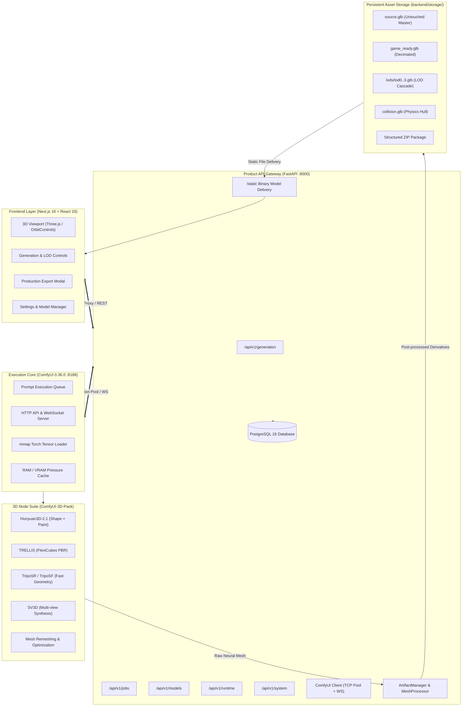
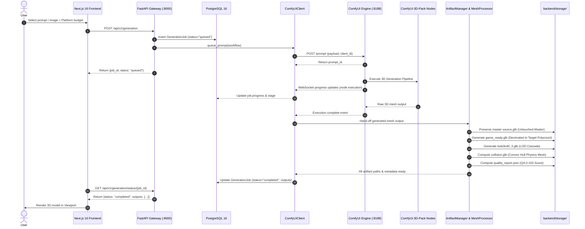

# AI 3D Studio — System & Runtime Architecture

> **Architecture Version**: 6.0.0 (ComfyUI Core + ComfyUI-3D-Pack Engine)  
> **Last Verified**: September 2026  
> **Target Environments**: Linux (Ubuntu 20.04/22.04/24.04), Google Colab (T4, V100, L4, A100), Cloud GPU / Local Workstations

---

## 1. Architectural Mission & Overview

AI 3D Studio is an end-to-end generative 3D asset pipeline. The system is architected around a clean separation of concerns:
- **Presentation Layer**: Next.js 16 frontend with interactive Three.js 3D viewport, Tripo-style tooling, and model management.
- **Product & API Gateway**: FastAPI backend managing database persistence (PostgreSQL 16), client validation, rate limiting, and static file delivery.
- **Execution Core**: **ComfyUI 0.36.0** as the single authoritative execution engine running in `ENGINE/ComfyUI`.
- **3D Node Layer**: **ComfyUI-3D-Pack** as the custom-node suite providing native 3D tensor operations, neural shape reconstruction, texture baking, and remeshing.



---

## 2. Component Layers

### 2.1 Presentation Layer (Next.js 16)
- **App Router**: Built on Next.js 16 with React 19 and Tailwind CSS.
- **API Client (`services/apiClient.ts`)**: Single unified HTTP/SSE client for all FastAPI backend communication (replaces legacy `adminService.ts` and `runtimeService.ts`). Uses `axios` with `get<T>`/`post<T>` wrappers and built-in SSE streaming support.
- **Reverse Proxy Route (`app/api/v1/[...path]/route.ts`)**: Proxies all frontend client requests to the FastAPI backend running on port 8000.
- **3D Canvas**: Three.js WebGL viewport supporting orbit controls, wireframe modes, matcap shading, and environment lighting.
- **Stores**: Lightweight Zustand stores managing generation state, active model selection, and UI panels.

### 2.2 Product API Gateway (FastAPI)
Located at `backend/app/`:
- **Lifespan Management (`app/main.py`)**: Automatically creates database tables on startup (`Base.metadata.create_all`), verifies ComfyUI engine connectivity, initializes storage roots, and closes connection pools on shutdown.
- **Comprehensive API Surface (`app/api/v1/`)**:
  - `/admin/*`: System overview, hardware telemetry, deep health, stream logs, model management, repair actions, and installation status.
  - `/settings/*`: Workspace settings, viewport configurations, generation defaults, and workspace clear history.
  - `/download/*`: Model download queues, start, pause, resume, and cancel operations.
  - `/upload/*`: Direct image, model, and asset multipart uploads.
  - `/generation/*`: Parameterized workflow preparation, prompt enhancement (`/enhance-prompt`), workflow templates (`/workflows`), history, and real-time status.
  - `/system/*`: Hardware telemetry, dependency checks, storage usage, cache clearing, and connection tests.
- **Database Engine (`app/database.py`)**: Asynchronous SQLAlchemy 2.0 engine backed by `asyncpg` with synchronous fallbacks for migrations.
- **Static File Server (`BinaryStaticFiles`)**: Optimized binary streaming for 3D model formats (`.glb`, `.gltf`, `.fbx`, `.obj`, `.stl`, `.zip`) with HTTP 86400s `Cache-Control` and `Accept-Ranges` byte-serving headers.
- **ComfyUI Client (`app/core/comfy/client.py`)**: High-performance HTTP client interfacing with ComfyUI's REST endpoints (`/prompt`, `/queue`, `/history`, `/free`, `/system_stats`, `/view`), native job cancellation (`POST /api/jobs/{prompt_id}/cancel`), and WebSocket real-time progress stream (`/ws`).

### 2.3 Execution Core (ComfyUI 0.36.0)
Located at `ENGINE/ComfyUI/`:
- **Single Execution Engine**: Replaces all legacy Celery task workers, Redis message brokers, and bespoke multi-venv runtimes.
- **Computational Graph Architecture**: Modular node graph execution with deterministic DAG validation.
- **Dynamic Model Loader**: Automatically manages model weights in VRAM, caching active checkpoints and offloading inactive layers.

### 2.4 3D Node Layer (ComfyUI-3D-Pack)
Located at `ENGINE/ComfyUI/custom_nodes/ComfyUI-3D-Pack/`:
- **Supported 3D Models**:
  - **Hunyuan3D-2.1**: High-fidelity shape generation (`hy3dshape`) and multi-view paint texture baking (`hy3dpaint`).
  - **TRELLIS**: Structured FlexiCubes PBR generation with 2048x2048 normal/roughness/metallic baking.
  - **TripoSR / TripoSF**: Fast single-image feedforward mesh reconstruction.
  - **SV3D**: Stable Video 3D multi-view image diffusion.
- **Mesh Processing**: Real-time Marching Cubes, remeshing algorithms, vertex attribute extraction, and GLB/OBJ serialization.

---

## 3. High-Performance Client & Engine Configuration

To eliminate latency and maximize throughput, several low-level optimizations are applied:

| Optimization | Target Layer | Mechanism | Impact |
|---|---|---|---|
| **Response Body Compression** | ComfyUI Engine | `--enable-compress-response-body` | Reduces network JSON and binary payload transfer size by 60–80%. |
| **mmap Tensor Loading** | ComfyUI Engine | `--mmap-torch-files` | Memory-maps safetensors directly from disk, preventing double memory allocation during checkpoint loading. |
| **Split Cross-Attention** | ComfyUI Engine (CPU) | `--use-split-cross-attention` | Optimizes attention calculations when running on CPU or unaccelerated compute. |
| **Async Weight Offload** | ComfyUI Engine (GPU) | `--async-offload 2` | Overlaps CUDA memory copies with inference compute using 2 dedicated streams. |
| **Persistent TCP Pooling** | FastAPI Client | `aiohttp.TCPConnector(limit=100, keepalive_timeout=60.0)` | Reuses TCP connections between FastAPI and ComfyUI, dropping HTTP handshake latency to sub-millisecond. |
| **System Stats Micro-Cache** | FastAPI Client | 3.0-second TTL cache in `health_check()` | Prevents `/system_stats` lock contention during high-frequency frontend polling. |
| **Object Info Cache** | FastAPI Client | In-memory node specification cache | Prevents repeated parsing of hundreds of node schemas. |
| **Explicit Memory Purge** | FastAPI Client | `POST /api/v1/runtime/clear-vram` → ComfyUI `/free` | Calls `/free` with `{"unload_models": False, "free_memory": True}` to clear cache without evicting warm model weights. |

---

## 4. End-to-End Generation Request Flow



---

## 5. Storage Directory Organization

All user assets and generation outputs are stored under `backend/storage/`:

```
backend/storage/
├── uploads/                    # User-uploaded reference images (.png, .jpg, .webp)
├── models/                     # Generated 3D assets organized per-job
│   └── <job_id>/
│       ├── source.glb          # Raw neural output (100% untouched master)
│       ├── game_ready.glb      # Decimated game-ready mesh (conforming to target poly budget)
│       ├── collision.glb       # Simplified convex hull physics collider
│       ├── lods/
│       │   ├── lod0.glb        # 100% triangles
│       │   ├── lod1.glb        # 50% triangles
│       │   ├── lod2.glb        # 25% triangles
│       │   └── lod3.glb        # 12.5% triangles
│       └── quality_report.json # Objective QA validation score (0-100)
├── thumbnails/                 # Rendered asset preview thumbnails (.png)
└── exports/                    # Structured ZIP packages for Unreal / Unity / Godot
```

---

## 6. Service Lifecycle Management

### 6.1 Installation (`scripts/install_comfyui.sh`)
- Idempotent script that clones official ComfyUI into `ENGINE/ComfyUI` and ComfyUI-3D-Pack into `ENGINE/ComfyUI/custom_nodes/ComfyUI-3D-Pack`.
- Installs Python dependencies using `uv pip` inside `backend/.venv`.
- Automatically applies compatibility patches for PyVista, PyMeshFix, and Torchvision tensor mocks.

### 6.2 Startup (`scripts/start.sh`)
Executes the native service stack in sequence:
1. **PostgreSQL**: Verifies database user `ai_studio` and database `ai_studio` on port 5432.
2. **Redis**: Starts `redis-server` on port 6379.
3. **Database Schema**: Executes `Base.metadata.create_all` via Python async engine.
4. **ComfyUI Engine**: Starts ComfyUI on port 8188 with performance flags (`--enable-compress-response-body`, `--mmap-torch-files`, and CPU/GPU attention offloading).
5. **FastAPI Gateway**: Starts Uvicorn on port 8000.
6. **Frontend**: Builds (or starts) Next.js on port 3000.

### 6.3 Shutdown (`scripts/stop.sh`)
- Gracefully sends `SIGTERM` followed by `SIGKILL` to Next.js, Uvicorn, and ComfyUI processes.
- Releases TCP ports 3000, 8000, and 8188 via `fuser` / `lsof`.
- Cleans up stale PID files in `.pids/`.

---

## 7. Verification & Automated Self-Checks

All backend capabilities are verified via `backend/tests/test_backend_e2e.py`:
- **Check 1: Configuration check**: Validates environment variables, paths, and API settings.
- **Check 2: Database CRUD check**: Creates, reads, updates, and deletes test generation jobs.
- **Check 3: ComfyUI connection check**: Queries ComfyUI `/system_stats` and verifies engine health.
- **Check 4: Workflow manager check**: Compiles parameterized workflows for text-to-3D, image-to-3D, texture, and remesh.
- **Check 5: Model registry check**: Confirms registered 3D models and capability flags.
