# Developer Guide — AI 3D Studio

> **Version**: 0.1.0
> **Last Updated**: September 2026

---

## 1. Architectural Principles

AI 3D Studio follows a clean separation between presentation, API gateway, and model execution:

```mermaid
flowchart TB
    classDef frontend fill:#1e293b,stroke:#3b82f6,stroke-width:2px,color:#fff
    classDef gateway fill:#0f172a,stroke:#8b5cf6,stroke-width:2px,color:#fff
    classDef execution fill:#1e293b,stroke:#f97316,stroke-width:2px,color:#fff

    subgraph FE["Frontend Layer (Next.js 16)"]
        direction TB
        APP["app/ Directory<br/>App Router, Layouts"]:::frontend
        FEATURES["features/ Directory<br/>WorkspaceShell, Admin"]:::frontend
        COMPONENTS["components/ Directory<br/>UI Components"]:::frontend
        STORES["stores/ Directory<br/>Zustand Stores"]:::frontend
        API_CLIENT["services/apiClient.ts<br/>Unified API Client"]:::frontend
    end

    subgraph GW["API Gateway Layer (FastAPI)"]
        direction TB
        MAIN["main_singleworker.py<br/>Entry Point"]:::gateway
        ROUTERS["routers/ Directory<br/>REST Controllers"]:::gateway
        CONFIG["core/config.py<br/>Pydantic Settings"]:::gateway
    end

    subgraph EX["Model Execution Layer"]
        direction TB
        SCHED["scheduler/<br/>VRAM-Aware Scheduler"]:::execution
        ADAPTERS["adapters/<br/>Model Adapters"]:::execution
        STORAGE["backend/storage/<br/>Persistent Storage"]:::execution
    end

    FE --> GW
    GW --> EX
    EX --> STORAGE

    style FE fill:#1e293b,stroke:#3b82f6
    style GW fill:#0f172a,stroke:#8b5cf6
    style EX fill:#1e293b,stroke:#f97316
```



---

## 2. Backend Development Workflow

### 2.1 Backend Directory Structure

```mermaid
flowchart TB
    classDef dir fill:#1e293b,stroke:#3b82f6,stroke-width:2px,color:#fff
    classDef file fill:#0f172a,stroke:#64748b,stroke-width:1px,color:#cbd5e1

    BACKEND["backend/"]:::dir
    BACKEND --> API["api/"]:::dir
    BACKEND --> CORE["core/"]:::dir
    BACKEND --> ADAPTERS["adapters/"]:::dir
    BACKEND --> CONFIG["config/"]:::dir
    BACKEND --> SCRIPTS["scripts/"]:::dir
    BACKEND --> THIRD["thirdparty/"]:::dir
    BACKEND --> REQ["requirements.txt"]:::file
    BACKEND --> REQTEST["requirements-test.txt"]:::file

    API --> MAIN1["main_singleworker.py"]:::file
    API --> MAIN2["main_multiworker.py"]:::file
    API --> ROUTERS["routers/"]:::dir
    ROUTERS --> R1["system.py"]:::file
    ROUTERS --> R2["file_upload.py"]:::file
    ROUTERS --> R3["mesh_generation.py"]:::file
    ROUTERS --> R4["mesh_editing.py"]:::file
    ROUTERS --> R5["auto_rigging.py"]:::file
    ROUTERS --> R6["mesh_segmentation.py"]:::file
    ROUTERS --> R7["mesh_retopology.py"]:::file
    ROUTERS --> R8["mesh_uv_unwrapping.py"]:::file
    ROUTERS --> R9["users.py"]:::file

    CORE --> CONFIG_PY["config.py"]:::file
    CORE --> FILESTORE["file_store.py"]:::file
    CORE --> SCHED["scheduler/"]:::dir
    SCHED --> SCHED1["scheduler_factory.py"]:::file
    SCHED --> SCHED2["multiprocess_scheduler.py"]:::file
    SCHED --> SCHED3["redis_job_queue.py"]:::file
    SCHED --> SCHED4["gpu_monitor.py"]:::file
    SCHED --> SCHED5["job_queue.py"]:::file
    CORE --> AUTH["auth/"]:::dir
    CORE --> UTILS["utils/"]:::dir

    ADAPTERS --> A1["trellis_adapter.py"]:::file
    ADAPTERS --> A2["trellis2_adapter.py"]:::file
    ADAPTERS --> A3["hunyuan3d_adapter_v21.py"]:::file
    ADAPTERS --> A4["partpacker_adapter.py"]:::file
    ADAPTERS --> A5["ultrashape_adapter.py"]:::file
    ADAPTERS --> A6["partfield_adapter.py"]:::file
    ADAPTERS --> A7["p3sam_adapter.py"]:::file
    ADAPTERS --> A8["unirig_adapter.py"]:::file
    ADAPTERS --> A9["fastmesh_adapter.py"]:::file
    ADAPTERS --> A10["voxhammer_adapter.py"]:::file
    ADAPTERS --> A11["partuv_adapter.py"]:::file
    ADAPTERS --> INIT["__init__.py"]:::file

    CONFIG --> SY["system.yaml"]:::file
    CONFIG --> MY["models.yaml"]:::file

    SCRIPTS --> SCHED_SVC["scheduler_service.py"]:::file
    SCRIPTS --> INSTALL["install.sh"]:::file
    SCRIPTS --> RUN_SVC["run_server.sh"]:::file
    SCRIPTS --> DL_MODELS["download_models.sh"]:::file
    SCRIPTS --> CREATE_ADMIN["create_admin_user.py"]:::file
    SCRIPTS --> BUILD_DOCKER["build_docker.sh"]:::file

    style BACKEND fill:#0f172a,stroke:#8b5cf6
```



### 2.2 Frontend API Client (`services/apiClient.ts`)

The frontend uses a **single unified `apiClient`** for all FastAPI communication. This is the only service layer the frontend depends on.

- **Constructor**: `createApiClient(config: ApiConfig)` initializes the singleton with baseURL, timeout, and optional Bearer auth token.
- **HTTP Methods**: `get<T>(path, ...args)`, `post<T>(path, data?, ...args)` — thin wrappers over `axios` that return `response.data` directly.
- **Generation Methods**: `textToRawMesh`, `textToTexturedMesh`, `imageToRawMesh`, `imageToTexturedMesh`, `textMeshPainting`, `imageMeshPainting`, `segmentMesh`, `generateRig`, `retopologizeMesh`, `unwrapMeshUV`, `textMeshEditing`, `imageMeshEditing`.
- **Streaming**: SSE-based event streaming for generation progress.
- **Export Helpers**: `getApiClient()` returns the singleton; `getApiUrl()` returns the configured baseURL.
- **Types**: All types defined in `types/api.ts`.

### 2.3 Adding a New Model Adapter

1. **Create the adapter** in `backend/adapters/<model_name>_adapter.py` implementing the `ModelAdapter` interface.
2. **Add model configuration** to `backend/config/models.yaml` under the appropriate feature (e.g., `text_to_textured_mesh`). Set `model_path` relative to the `backend/pretrained/` directory.
3. **Register the adapter** in `backend/adapters/__init__.py`.
4. **Add download logic** to `backend/scripts/download_models.sh`:
   - Add the model slug to `AVAILABLE_MODELS`
   - Add a `download_<model>()` function using `hf download <repo> <file> --local-dir <path>`
   - Add a verification entry in `verify_all_models()`
5. **Update `manager.sh`** if the model should be included in the "download all" flow.
6. **Update this guide** with the new model in the model reference table (Section 3.1) and pretrained directory structure (Section 3.2).
7. The scheduler's `validate_model_preference()` and `get_available_models()` automatically pick up new models from `models.yaml`.

### 2.4 Adding a New API Router

1. Create `backend/api/routers/<feature_name>.py` with an `APIRouter` instance.
2. Define request/response Pydantic models in the router file.
3. Use `get_scheduler()` and `get_file_store()` dependencies from `api.dependencies`.
4. Include the router in `main_singleworker.py` or `main_multiworker.py`:
   ```python
   app.include_router(my_router.router, prefix="/api/v1/my-feature", tags=["My Feature"])
   ```

### 2.5 Frontend Contract & Response Envelopes

All FastAPI responses should follow the standard envelope:
```json
{
  "job_id": "gen_abc123",
  "status": "queued",
  "message": "Generation job queued"
}
```
The frontend's `apiClient.ts` validates responses and handles errors.

---

## 3. Supported Models & Pretrained Directory

### 3.1 Model Reference

| Category | Model | Input | Output | VRAM | Notes |
|----------|-------|-------|--------|------|-------|
| Text/Image to 3D | TRELLIS image-large | Text/Image | Textured Mesh | 12GB | Medium-quality, geometry & texture |
| Text/Image to 3D | Hunyuan3D-2.1 | Image | Raw Mesh | 8GB | Fast, medium quality, geometry only |
| Text/Image to 3D | Hunyuan3D-2.1 | Image | Textured Mesh | 19GB | Medium-quality, geometry & texture |
| Text/Image to 3D | TRELLIS.2-4B | Image | Textured Mesh | 24GB | High-quality textured geometry |
| Text/Image to 3D | UltraShape | Image | Textured Mesh | 25GB | High-quality textured geometry |
| Text/Image to 3D | PartPacker | Image | Raw Mesh | 10GB | Part-Level, geometry only |
| Text/Image to 3D | Hunyuan3D-2.0 mini | Text/Image | Textured Mesh | 8GB | Compact Hunyuan3D variant |
| Rigging | UniRig | Mesh | Rigged Mesh | 9GB | Automatic skeleton generation |
| Segmentation | PartField | Mesh | Segmented Mesh | 4GB | Semantic part segmentation |
| Segmentation | P3-SAM | Mesh | Segmented Mesh | 48GB | Semantic part segmentation |
| Painting | TRELLIS Paint | Text/Image + Mesh | Textured Mesh | 8GB/4GB | Text/image-guided painting |
| Painting | Hunyuan3D-2.1 Paint | Mesh + Image | Textured Mesh | 12GB | High-quality texture synthesis, PBR |
| Retopology | FastMesh v1k | Dense Mesh | Low Poly Mesh | 16GB | Fast artist mesh generation |
| Retopology | FastMesh v4k | Dense Mesh | Low Poly Mesh | 24GB | Fast artist mesh generation |
| UV Unwrapping | PartUV | Mesh | Mesh w/ UV | 7GB | Part-Based UV Unwrapping |
| Editing | VoxHammer (Text) | Mesh + Text | Edited Mesh | 40GB | Text-guided local mesh editing |
| Editing | VoxHammer (Image) | Mesh + Image | Edited Mesh | 40GB | Image-guided local mesh editing |

### 3.2 Pretrained Directory Structure

Models are stored under `backend/pretrained/`. A symlink at the project root (`pretrained -> backend/pretrained`) preserves compatibility with existing code and third-party submodules. Adapters resolve paths relative to `os.getcwd()`, so the project root remains the base when the backend is started from there:

```
backend/pretrained/
├── PartField/
│   └── model_objaverse.pt
├── tencent/
│   ├── Hunyuan3D-2/
│   ├── Hunyuan3D-2mini/
│   └── Hunyuan3D-2.1/
├── TRELLIS/
│   ├── TRELLIS-image-large/
│   └── TRELLIS-text-xlarge/
├── TRELLIS.2/
│   └── TRELLIS.2-4B/
├── UniRig/
├── PartPacker/
├── PartUV/
├── FastMesh-V1K/
├── FastMesh-V4K/
├── P3-SAM/
│   └── p3sam.safetensors
├── UltraShape/
│   └── ultrashape_v1.pt
├── misc/
│   └── RealESRGAN_x4plus.pth
└── dinov2-giant/
```

### 3.3 Model Download

Use `backend/scripts/download_models.sh` to fetch models. It uses the `hf` CLI from `huggingface_hub`. The script resolves paths relative to its own location, so it works when run from either the project root or the `backend/` directory:

```bash
# From project root
bash backend/scripts/download_models.sh -m ultrashape

# Or cd into backend and run directly
cd backend && bash scripts/download_models.sh -m ultrashape

# Verify all downloaded models
bash backend/scripts/download_models.sh -v

# Force re-download
bash backend/scripts/download_models.sh -f -m p3sam

# List available models
bash backend/scripts/download_models.sh --list
```

## 5. Scheduler Development

The VRAM-aware scheduler is the core of the backend. Key concepts:

### 4.1 Single-Worker Scheduler

```python
from core.scheduler.scheduler_factory import create_development_scheduler

scheduler = create_development_scheduler(
    gpu_monitor=GPUMonitor(memory_buffer=1024),
    models_config=settings.models,
)
await scheduler.start()
```

### 4.2 Multi-Worker Redis Queue

```python
from core.scheduler.redis_job_queue import RedisJobQueue

queue = RedisJobQueue(
    redis_url="redis://localhost:6379",
    queue_prefix="3daigc",
    max_job_age_hours=24,
)
await queue.connect()
```

### 4.3 Adding GPU Memory Management

The `GPUMonitor` tracks VRAM usage and enforces mutual exclusion:
- `memory_buffer=1024` keeps 1GB free as safety margin.
- `MAX_VRAM_MB=0` in `.env` enables auto-detection.
- `VRAM_SAFETY_MARGIN_MB=1024` configures the safety buffer.

---

## 5. Frontend Development

```mermaid
flowchart LR
    classDef input fill:#1e293b,stroke:#3b82f6,stroke-width:2px,color:#fff
    classDef route fill:#0f172a,stroke:#8b5cf6,stroke-width:2px,color:#fff
    classDef state fill:#1e293b,stroke:#10b981,stroke-width:2px,color:#fff
    classDef render fill:#0f172a,stroke:#f97316,stroke-width:2px,color:#fff

    USER["User Interaction<br/>Prompt / Image Upload"]:::input --> ROUTE["New Route<br/>app/workspace/tool/page.tsx"]:::route
    ROUTE --> SHELL["WorkspaceShell.tsx<br/>Register Tool Panel"]:::route
    SHELL --> STORE["Zustand Store<br/>useAppStore / useViewerStore"]:::state
    STORE --> CLIENT["apiClient.ts<br/>Unified API Methods"]:::state
    STORE --> VIEWPORT["3D Viewport<br/>Three.js / R3F"]:::render
    CLIENT -->|"REST / SSE"| BACKEND["FastAPI Backend :7842"]:::state
    BACKEND --> SCHED["VRAM-Aware Scheduler"]:::render
    SCHED --> ADAPTER["Model Adapter"]:::render
    ADAPTER --> STORAGE["Storage (backend/storage/)"]:::render

    style USER fill:#1e293b,stroke:#3b82f6
```



### 5.1 Adding a New Workspace Tab

1. Add a route in `app/` (e.g., `app/workspace/my-tool/page.tsx`).
2. Add the tool to `ROUTE_SEGMENT_TO_TOOL` in `features/workspace/WorkspaceShell.tsx`.
3. Create the panel component in `features/workspace/Panels/`.
4. Add the panel to `renderToolPanel()` in `WorkspaceShell.tsx`.
5. Add any required types to `types/api.ts`.

### 5.2 Adding API Client Methods

1. Add the method signature to `types/api.ts`.
2. Implement the method in `services/apiClient.ts`.
3. Import and call from any feature module.

### 5.3 State Management

Zustand stores are in `stores/`:
- `useAppStore.ts`: Generation state, model selection, UI panels.
- `useViewerStore.ts`: 3D viewport state.
- `useAnimationStore.ts`: Animation studio state.
- `useUIStore.ts`: UI proxy store.

Add new state properties to the store interface and define actions.

---

## 6. Testing & Verification

The backend exposes a health endpoint for runtime verification:
```bash
curl -s http://localhost:7842/health | jq .
```

### Frontend Type Check
```bash
npx tsc --noEmit
```

### Frontend Build Test
```bash
bun run build
```

> **Note**: An automated `backend/tests/test_backend_e2e.py` test script referenced in earlier documentation does not currently exist. The health endpoint and TypeScript compiler provide the available self-check mechanisms.

---

## 7. Service Orchestration Scripts

- **`backend/scripts/install.sh`**: Full system setup (Conda env `3daigc-api` Python 3.10, CUDA 12.4, PyTorch 2.6.0, all thirdparty model dependencies, main project dependencies). The primary setup script.
- **`backend/scripts/run_server.sh`**: Multi-worker deployment launcher (starts scheduler service + 4 uvicorn workers).
- **`manager.sh`** (repo root): Interactive service management menu (setup/status/start/stop/restart/logs/clean/cloudflare/models).
- **`scripts/setup.sh`**: System-level setup (Node.js, Bun, system libraries).
- **`scripts/start.sh` / `scripts/stop.sh` / `scripts/restart.sh`**: Service lifecycle management.
- **`scripts/colab.sh`**: Google Colab launcher.
- **`backend/scripts/download_models.sh`**: Model download script using `hf`. Supports `-m` (model selection), `-v` (verify), `-f` (force), `--list`.
- **`backend/scripts/scheduler_service.py`**: Standalone GPU scheduler service for multi-worker mode.
- **`backend/scripts/create_admin_user.py`**: Creates an admin user in Redis (used when `user_auth_enabled=true`).
- **`backend/scripts/build_docker.sh`**: Docker build helper.

> **Note**: Some scripts referenced in earlier documentation (`colab_start.sh`, `colab_stop.sh`, `colab_restart.sh`, `colab_status.sh`, `colab_watch.sh`, `colab_keepalive_js.py`, `test_latency.py`, `test_pipeline_and_export.py`) do not currently exist in the repository.

---

## 8. Key Configuration Files

### system.yaml (`backend/config/system.yaml`)

```yaml
logging:
  level: "INFO"
  format: "%(asctime)s - %(name)s - %(levelname)s - %(message)s"
  file: null

security:
  rate_limit_per_minute: 60
  cors_origins: ["*"]
  api_key_required: false

environment: "production"
debug: false

user_auth_enabled: false
```

### models.yaml (`backend/config/models.yaml`)

Each feature maps model IDs to configurations:
```yaml
text_to_textured_mesh:
  trellis_text_to_textured_mesh:
    vram_requirement: 11776  # MB
    supported_inputs: ["text"]
    supported_outputs: ["glb", "obj"]
    model_path: "thirdparty/TRELLIS"
    enabled: true
    max_workers: 1
```

---

## 9. Debugging Tips

### Backend Debugging
```bash
# Run with debug mode
P3D_DEBUG=true uvicorn api.main_singleworker:app --reload --port 7842

# Check GPU monitoring
curl -s http://localhost:7842/api/v1/system/info | jq .system

# Check scheduler status
curl -s http://localhost:7842/api/v1/mesh-generation/models | jq .
```

### Frontend Debugging
```bash
# Run in development mode
bun run dev

# Check browser console for API errors
# The apiClient.ts logs all requests and responses
```
