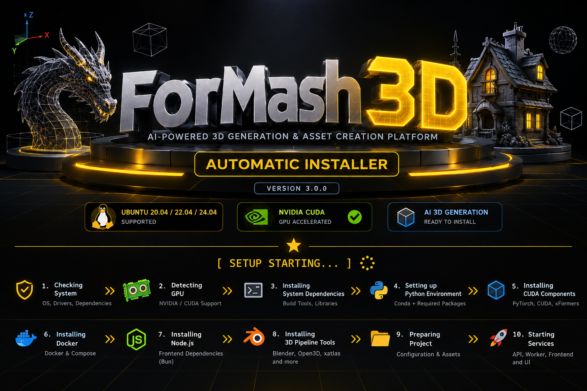

<!-- ===================== HERO BANNER ===================== -->

<p align="center">
  
</p>

<h1 align="center">
    ForMash 3D
</h1>

<p align="center">
  <strong>ForMash 3D — AI-powered 3D generation and asset creation platform.</strong><br>
  Neural Reconstruction • Safe Post-Processing • Multi-Tier LODs • Physics Colliders • Automated QA • Multi-Format Export
</p>

<p align="center">
  
  
  
  
  
  
</p>

---

> [!IMPORTANT]
> **Project Status: Early Pre-Alpha & Experimental**  
> ForMash 3D is currently an **early experimental, pre-alpha project** and has not yet reached a stable alpha release. Features, model integrations, workflows, and APIs may change rapidly. Certain components may be incomplete, unoptimized, or experimental. It is provided for developers, researchers, and technical artists to explore, test, and contribute to local generative 3D pipelines.

> [!NOTE]
> **Vibe-Coded & AI-Assisted Development Disclosure**  
> This project is heavily AI-assisted and vibe-coded. That means some areas of the codebase contain non-uniform patterns, rough edges, technical debt, and experimental shortcuts. Community contributions—including bug reports, unit tests, code cleanup, documentation improvements, and model adapter refinements—are actively welcomed! See [CONTRIBUTING.md](CONTRIBUTING.md).

> [!NOTE]
> **Inspiration & Non-Affiliation Disclaimer**  
> ForMash 3D draws design and workflow inspiration from the simplicity of modern AI 3D creation platforms such as **Tripo** and **Meshy AI**. However, ForMash 3D is an independent open-source project and is **not affiliated with, endorsed by, sponsored by, or officially connected to** Tripo, Meshy AI, or their parent entities.  
> Technical model identifiers referenced in this repository (such as `TripoSR`, `TripoSG`, and `TripoSF`) are legitimate upstream research model names developed by VAST-AI Research and are preserved strictly for technical identity and provenance.

---

## 📰 Recent Updates

> Compact overview of recent milestone updates (maximum 3 entries preserved; full technical history available in **[Docs/CHANGELOG.md](Docs/CHANGELOG.md)**).

* **2026-09-25** — **Project Rebrand to ForMash 3D**: Executed complete first-party rebrand from AI Studio to ForMash 3D (`ForMash3D`) across UI, API gateway, documentation, and web assets while preserving backward-compatible environment variables.
* **2026-09-25** — **Repository & Submodule Migration**: Updated canonical repository origin to `Silentzx2/ForMash3D` and submodule tree to `Silentzx2/ForMash3D-ThirdParty` with bundled prebuilt CUDA wheelhouse.
* **2026-09-21** — **v0.1.0 Architecture Release**: Next.js 16 + FastAPI unified gateway, 19-model registry, VRAM-aware multiprocess scheduler, automated LOD cascade, and mesh QA engine.

---

## 📖 Table of Contents

- [📰 Recent Updates](#-recent-updates)
- [⚡ Overview](#-overview)
- [🏛️ Backend Provenance](#️-backend-provenance)
- [⚠️ Script Safety & Security Warnings](#️-script-safety--security-warnings)
- [🏗️ System Architecture](#️-system-architecture)
- [🤖 Supported Model Catalog](#-supported-model-catalog)
- [🛠️ Technology Stack](#️-technology-stack)
- [📦 Installation & Quick Start](#-installation--quick-start)
  - [Prerequisites](#prerequisites)
  - [Clone with Submodules](#clone-with-submodules)
  - [Environment Setup](#environment-setup)
  - [Manual Development Setup](#manual-development-setup)
  - [Model Weights & Downloads](#model-weights--downloads)
  - [Access Points](#access-points)
- [⚖️ Third-Party Model Licenses](#️-third-party-model-licenses)
- [⚙️ Configuration](#️-configuration)
- [🎮 Application Usage](#-application-usage)
- [🔌 API Endpoints Reference](#-api-endpoints-reference)
- [🛠️ Development & Testing](#️-development--testing)
- [🤝 Contributing](#-contributing)
- [🔒 Security Reporting](#-security-reporting)
- [📁 Project Structure](#-project-structure)
- [🔧 Troubleshooting](#-troubleshooting)
- [📚 Documentation Index](#-documentation-index)
- [📄 License](#-license)

---

## ⚡ Overview

**ForMash 3D** is an open-source generative 3D asset platform. It bridges open-source neural shape, texture, and motion synthesis models (**Hunyuan3D-2.1**, **TRELLIS**, **TripoSR**, **TripoSG**, **TripoSF**, **ARDY**, **PartPacker**, **UltraShape**, **PartField**, **FastMesh**, **VoxHammer**) with a post-processing workflow designed to preserve raw master geometry while generating engine-compliant game assets with automated Level-of-Detail (LOD) cascades, physics collision hulls, and objective QA validation scores.

### Key Capabilities
- **FastAPI Backend**: High-throughput REST API with VRAM-aware multiprocess scheduler and optional Redis multi-worker queue.
- **3D Production Workflows**: Native UV Unwrapping (`/workspace/uv`), PartField Semantic Mesh Segmentation (`/workspace/segment`), VoxHammer Neural Mesh Editing (`/workspace/edit`), UniRig Auto-Rigging & ARDY Motion AI (`/animation`), and Dedicated Run Inspector (`/workspace/jobs`).
- **Live Models Registry Manager**: System model catalog (`/admin?tab=models`) exposing real VRAM budgets, task capabilities, and parameters directly from `models.yaml`.
- **Master Asset Lineage & Chaining**: Sequential downstream workflow chaining (Generate → Poly → UV → Texture → Segment → Edit → Rig) using canonical backend asset identities.
- **Automated LOD Generation**: Generates LOD0 (100%), LOD1 (50%), LOD2 (25%), and LOD3 (12.5%) variants with UV and material preservation via `meshoptimizer`.
- **Convex Hull Physics Colliders**: Produces watertight simplified collision geometry for immediate game engine physics.
- **Objective QA Diagnostic Engine**: Analyzes non-manifold edges, UV overlap, component counts, and poly budgets with a composite 0–100 score.
- **Modular Game-Ready Export**: One-click download of structured ZIP packages formatted for Unreal Engine 5, Unity, and Godot 4.

---

## 🏛️ Backend Provenance

The backend of ForMash 3D was forked and adapted from the open-source project **[3DAIGC-API](https://github.com/FishWoWater/3DAIGC-API)** by FishWoWater, and has since been extensively modified and expanded. 

Since forking, the backend has been refactored for Next.js 16 frontend coordination, unified under Python 3.10 and PyTorch 2.6 / CUDA 12.4 runtime targets, integrated with a clean public release model catalog, extended with additional generative 3D model adapters (including TRELLIS.2, PartField, UltraShape, TripoSR/SG/SF, UniRig, ARDY), and enhanced with strict VRAM-aware multiprocess scheduling. We gratefully acknowledge the upstream authors and foundational work of [FishWoWater/3DAIGC-API](https://github.com/FishWoWater/3DAIGC-API).

---

## ⚠️ Script Safety & Security Warnings

> [!WARNING]
> **Inspect Setup Scripts Before Execution**  
> ForMash 3D provides automated setup shell scripts (`scripts/setup.sh`, `backend/scripts/install.sh`, `manager.sh`). Because neural 3D modeling relies on compiled C++/CUDA kernels and specialized GPU toolchains, these scripts may:
> - Install system packages via `apt` (requiring `sudo`).
> - Modify or sanitize system APT CUDA repository sources in `/etc/apt/sources.list.d/`.
> - Create or modify Conda/venv virtual environments named `3daigc-api`.
> - Download and install multi-gigabyte PyTorch CUDA wheels.
> - Modify local environment variables (`PATH`, `LD_LIBRARY_PATH`).
>
> **Best Practice**: Developers should inspect scripts before running them. **Always run ForMash 3D in an isolated container, a disposable cloud GPU instance (e.g. RunPod, Vast.ai), or a dedicated development environment**, rather than a primary personal workstation or production system.

---

## 🏗️ System Architecture

```mermaid
flowchart TB
    classDef client fill:#1e293b,stroke:#3b82f6,stroke-width:2px,color:#fff
    classDef gateway fill:#0f172a,stroke:#8b5cf6,stroke-width:2px,color:#fff
    classDef scheduler fill:#1e293b,stroke:#f97316,stroke-width:2px,color:#fff
    classDef adapters fill:#0f172a,stroke:#10b981,stroke-width:2px,color:#fff
    classDef storage fill:#1e293b,stroke:#64748b,stroke-width:2px,color:#fff
    classDef queue fill:#0f172a,stroke:#ec4899,stroke-width:2px,color:#fff

    subgraph Client["Next.js 16 Frontend 🌐 :3000"]
        UI["Interactive UI<br/>React 19 + Three.js"]
        STATE["Zustand Global State"]
        QUERY["TanStack Query"]
        RADIX["Radix UI"]
        MOTION["Framer Motion"]
    end

    subgraph Gateway["FastAPI Gateway 🌐 :7842"]
        ROUTERS["API Routers<br/>/v1/system /v1/generation<br/>/v1/mesh-* /v1/users"]
        AUTH["CORS · Auth<br/>Rate Limiting"]
        SCHED["VRAM-Aware Scheduler"]
    end

    subgraph S["VRAM-Aware Scheduler"]
        GPU_LOCK["GPU Mutual Exclusion"]
        MONITOR["GPU Monitoring<br/>VRAM / Temp"]
        SAFETY["VRAM Safety Buffer<br/>1GB Free Margin"]
        AUTO_UNLOAD["Auto-Unload After Job"]
    end

    subgraph Adapters["Model Adapters"]
        TRELLIS["TRELLIS<br/>FlexiCubes PBR"]
        HUNY["Hunyuan3D-2.1<br/>DiT + Paint"]
        TRIPO["TripoSR / TripoSG / TripoSF<br/>Feedforward & SparseFlex 3D"]
        ARDY["ARDY<br/>Motion AI & Animation"]
        PP["PartPacker<br/>Rectified Flow"]
        US["UltraShape<br/>Arbitrary Topology"]
        PF["PartField<br/>Segmentation"]
        UR["UniRig<br/>Auto-Rigging"]
        FM["FastMesh<br/>Retopology"]
        VH["VoxHammer<br/>Mesh Editing"]
    end

    subgraph Storage["Persistent Storage"]
        SRC["source.glb<br/>Untouched Master"]
        GAME["game_ready.glb<br/>Engine-Optimized"]
        L0["LOD0 (100%)"]
        L1["LOD1 (50%)"]
        L2["LOD2 (25%)"]
        L3["LOD3 (12.5%)"]
        COL["collision.glb<br/>Convex Hull"]
        QA["quality_report.json<br/>QA 0-100"]
    end

    Client -- "REST / SSE / WS" --> Gateway
    Gateway --> AUTH
    Gateway --> SCHED
    SCHED --> GPU_LOCK
    SCHED --> MONITOR
    SCHED --> SAFETY
    SCHED --> AUTO_UNLOAD
    Gateway --> ROUTERS
    ROUTERS --> Adapters
    Adapters -- "Raw Mesh Output" --> Storage
    Storage -- "Static Delivery" --> Gateway

    style Client fill:#1e293b,stroke:#3b82f6
    style Gateway fill:#0f172a,stroke:#8b5cf6
    style S fill:#1e293b,stroke:#f97316
    style Adapters fill:#0f172a,stroke:#10b981
    style Storage fill:#1e293b,stroke:#64748b
```



---

## 🤖 Supported Model Catalog

The model registry is dynamically configured via `backend/config/models.yaml`.

| Model | Category | VRAM Requirement | Est. Latency | Key Capabilities |
|---|---|---|---|---|
| **Hunyuan3D-2.1** | Shape + Texture | 8–19.5 GB | ~90s | High-fidelity shape generation, multi-view paint diffusion |
| **TRELLIS** | Structured 3D | 11.5 GB | ~60s | FlexiCubes PBR meshes, 2048x2048 textures |
| **TRELLIS.2** | Structured 3D | 23.5 GB | ~60s | Higher-fidelity FlexiCubes with advanced PBR |
| **TripoSR** | Image-to-Mesh | 6 GB | ~2–5s | Ultra-fast feedforward single-image 3D reconstruction |
| **TripoSG** | Image/Scribble-to-Mesh | 8 GB | ~10–20s | High-fidelity image and scribble guided 3D geometry |
| **TripoSF** | SparseFlex Mesh | 12 GB | ~5–15s | High-resolution arbitrary-topology modeling with SparseFlex VAE |
| **ARDY** | Motion AI | 8 GB | ~10–25s | Interactive autoregressive text-to-motion generation |
| **PartPacker** | Image-to-Mesh | 10 GB | ~60s | Rectified-flow part-level shape generation |
| **UltraShape** | Image-to-Mesh | 26.6 GB | ~30s | Arbitrary-topology mesh reconstruction |
| **PartField** | Segmentation | 4 GB | ~15s | Semantic part decomposition of 3D meshes |
| **P3-SAM** | Segmentation | 60 GB | ~15s | High-precision 3D SAM segmentation |
| **UniRig** | Auto-Rigging | 9 GB | ~20s | Automated bipedal skeletal armature generation |
| **FastMesh-V1K** | Retopology | 16 GB | ~30s | Fast neural retopology and manifold cleanup |
| **FastMesh-V4K** | Retopology | 24.5 GB | ~30s | High-resolution dense mesh retopology |
| **VoxHammer** | Mesh Editing | 40 GB | ~20s | Voxel-guided localized neural mesh editing |

---

## 🛠️ Technology Stack

| Layer | Technology | Purpose |
|---|---|---|
| **Frontend Framework** | Next.js 16 (App Router), React 19, TypeScript | Reactive web application |
| **UI Components** | Tailwind CSS v4, Radix UI, Lucide Icons | Dark studio workspace interface |
| **State Management** | Zustand | Real-time global client state |
| **Data Fetching** | TanStack Query (React Query) | Server-state caching & synchronization |
| **3D Rendering** | Three.js, React Three Fiber | WebGL model inspection, wireframe, lighting |
| **Backend Framework** | FastAPI, Python 3.10, Pydantic V2 | High-throughput async REST API |
| **Scheduler** | VRAM-aware multiprocess scheduler | GPU mutual exclusion, job queuing |
| **Queue/Broker** | Redis 7 (multi-worker mode) | Distributed job queue |
| **File Storage** | Local filesystem + Redis FileStore | Asset management, multi-tier LOD storage |
| **Frontend PM** | Bun | Authoritative frontend package manager |
| **Python PM** | Conda / uv / pip | Python 3.10 virtual environment |

---

## 📦 Installation & Quick Start

### Prerequisites

- **OS**: Linux (Ubuntu 20.04, 22.04, or 24.04 recommended)
- **GPU**: NVIDIA GPU with CUDA 12.4 capability (minimum 8GB VRAM for basic models, 16GB+ recommended)
- **Node & Package Manager**: [Bun](https://bun.sh/)
- **Python**: Python 3.10 (via Conda environment `3daigc-api`)
- **Disk Space**: At least 50 GB free disk space (models and cache require significant storage)

### Clone with Submodules

ForMash 3D manages third-party model source trees via a Git submodule in `backend/thirdparty`. Always clone recursively:

```bash
git clone --recurse-submodules https://github.com/Silentzx2/ForMash3D.git
cd ForMash3D
```

If you previously cloned without `--recurse-submodules`, initialize the submodule manually:

```bash
git submodule update --init --recursive
```

### Environment Setup

Copy the example configuration file:

```bash
cp .env.example .env
```

Review `.env` to configure ports, storage paths, and optional Hugging Face tokens (`HF_TOKEN`) for gated models.

### Manual Development Setup

#### 1. Backend (FastAPI Gateway)

```bash
# Create and activate Python 3.10 environment
conda create -n 3daigc-api python=3.10 -y
conda activate 3daigc-api

# Install PyTorch with CUDA 12.4 support
pip install torch torchvision --index-url https://download.pytorch.org/whl/cu124

# Install backend dependencies
pip install -r backend/requirements.txt

# Start FastAPI server
cd backend
uvicorn api.main_singleworker:app --reload --port 7842
```

#### 2. Frontend (Next.js 16)

```bash
# In the root repository directory
bun install
bun run dev
```

Open `http://localhost:3000` in your browser.

### Model Weights & Downloads

Cloning the repository does **not** download multi-gigabyte neural network weights. Pretrained checkpoints can be downloaded using the interactive download script:

```bash
bash backend/scripts/download_models.sh
```

Alternatively, models using the Hugging Face Hub (such as TripoSR, TRELLIS) will download weights to your local Hugging Face cache on their first execution if an internet connection and valid token (where gated) are available.

### Access Points

| Service | Address | Port | Description |
|---|---|---|---|
| **Frontend Workspace** | `http://localhost:3000` | 3000 | Interactive generation and 3D viewport |
| **Backend REST API** | `http://localhost:7842` | 7842 | FastAPI application gateway |
| **Interactive API Docs** | `http://localhost:7842/docs` | 7842 | Swagger UI with test sandbox |
| **Health Check** | `http://localhost:7842/health` | 7842 | Service health status |

---

## ⚖️ Third-Party Model Licenses

ForMash 3D is an open-source project licensed under the **Apache License 2.0**. However, the third-party models integrated into ForMash 3D are authored by independent research teams and governed by their respective licenses:

- **MIT License**: TRELLIS code, TripoSR.
- **Apache 2.0**: UniRig, P3-SAM.
- **Tencent Hunyuan Community License**: Hunyuan3D-2.1, Hunyuan3D-Part.
- **NVIDIA Non-Commercial / Research**: PartPacker, PartField, ARDY.
- **Academic Research Licenses**: PartUV, UltraShape, FastMesh.

ForMash 3D does **not** own or claim rights to these third-party architectures or weights. For full license terms, author attribution, and commercial use restrictions, please read **[Docs/MODEL_LICENSES.md](Docs/MODEL_LICENSES.md)**.

---

## ⚙️ Configuration

Key environment variables in `.env`:

```env
# ===== APPLICATION =====
ENVIRONMENT=development
DEBUG=true
APP_NAME=AI 3D Studio API
APP_VERSION=0.1.0

# ===== BACKEND =====
BACKEND_URL=http://localhost:7842
REDIS_URL=redis://localhost:6379/0

# ===== GPU / CUDA =====
CUDA_DEVICE=auto
MAX_VRAM_MB=0        # 0 = auto-detect
VRAM_SAFETY_MARGIN_MB=1024
AUTO_UNLOAD_AFTER_JOB=true

# ===== STORAGE =====
STORAGE_LOCAL_PATH=./backend/storage
DOWNLOAD_CHUNK_SIZE_MB=5
DOWNLOAD_MAX_RETRIES=3

# ===== API =====
API_V1_PREFIX=/api/v1
CORS_ORIGINS=["http://localhost:3000"]
P3D_USER_AUTH_ENABLED=false
```

---

## 🎮 Application Usage

### Workspaces & Routes

| Workspace | Route | Purpose | Compatible Models |
|---|---|---|---|
| **Generate** | `/workspace` | Primary shape generation from text or image | TRELLIS, Hunyuan3D, PartPacker, UltraShape, TripoSR/SG/SF |
| **Texture** | `/workspace/texture` | PBR material synthesis, multi-view paint projection | TRELLIS, Hunyuan3D-2.1 |
| **Remesh** | `/workspace/remesh` | Retopology, decimation, manifold cleanup | FastMesh-V1K, FastMesh-V4K |
| **Edit** | `/workspace/edit` | Local neural mesh editing with VoxHammer | VoxHammer |
| **Animation** | `/animation` | Auto-rigging (UniRig) + motion generation (ARDY) | UniRig, ARDY |
| **Segment** | `/workspace/segment` | Semantic part segmentation | PartField, P3-SAM |
| **UV Tool** | `/workspace/uv` | Automated UV unwrapping and packing | PartUV, xatlas |
| **Job Inspector** | `/workspace/jobs` | Real-time queue and GPU memory inspector | — |
| **Admin** | `/admin` | Telemetry, models registry & storage settings | — |

---

## 🔌 API Endpoints Reference

### System & Health
- `GET /health`: Health check with timestamp and status.
- `GET /api/v1/system/health`: Extended system health.
- `GET /api/v1/system/info`: Host hardware specs, OS, RAM, GPU telemetry.

### File Upload & Storage
- `POST /api/v1/file-upload/image`: Upload reference image.
- `POST /api/v1/file-upload/mesh`: Upload base mesh for post-processing/rigging.
- `GET /api/v1/file-upload/download/{file_id}`: Stream stored file with MIME headers.

### Mesh Generation & Processing
- `POST /api/v1/mesh-generation/image-to-raw-mesh`: Geometry synthesis from image.
- `POST /api/v1/mesh-generation/image-to-textured-mesh`: Full PBR geometry + texture from image.
- `POST /api/v1/mesh-generation/text-to-raw-mesh`: Geometry synthesis from text prompt.
- `GET /api/v1/mesh-generation/status/{job_id}`: Real-time generation job status.
- `POST /api/v1/mesh-editing/text-edit`: Edit existing mesh with prompt.
- `POST /api/v1/auto-rigging/rig-mesh`: Generate skeletal rig with UniRig.
- `POST /api/v1/mesh-segmentation/segment-mesh`: Decompose mesh into parts.
- `POST /api/v1/mesh-retopology/retopology-mesh`: Retopologize dense mesh.
- `POST /api/v1/mesh-uv-unwrapping/unwrap-mesh`: Generate UV atlas.

For detailed schema specifications, see [Docs/api-documentation.md](Docs/api-documentation.md) or visit `/docs` on the running backend.

---

## 🛠️ Development & Testing

```bash
# Verify API contracts and route registrations
python3 scripts/verify_contracts.py

# Check TypeScript types
npx tsc --noEmit

# Run ESLint
bun run lint

# Compile Python files to check syntax
python3 -m compileall backend/api backend/core backend/adapters
```

---

## 🤝 Contributing

Contributions are warmly welcomed! Whether you are fixing bugs, improving documentation, writing tests, optimizing CUDA compilation, or adding new 3D model adapters, please review our contribution guide:

👉 **[CONTRIBUTING.md](CONTRIBUTING.md)**

Please keep pull requests focused, provide reproduction steps for bug fixes, and maintain existing third-party attribution.

---

## 🔒 Security Reporting

If you find a security vulnerability, please do **NOT** open a public issue. Review our disclosure process in **[SECURITY.md](SECURITY.md)**.

---

## 📁 Project Structure

```text
ForMash3D/
├── app/                               # Next.js 16 App Router
│   ├── layout.tsx                     # Root layout & themes
│   ├── page.tsx                       # Landing page / workspace entry
│   ├── workspace/page.tsx             # Workspace studio shell
│   ├── animation/page.tsx             # Skeletal rigging & motion studio
│   ├── admin/page.tsx                 # Diagnostics & models registry
│   └── api/                           # API proxy endpoints
│
├── features/                          # Feature modules
│   ├── workspace/                     # Viewport, inspector, toolbar, panels
│   ├── admin/                         # System monitoring & storage tabs
│   └── settings/                      # Preferences & model manager
│
├── components/                        # Shared UI components (Radix / Tailwind)
├── hooks/                             # React hooks (viewport, telemetry)
├── services/                          # API clients (FastAPI REST & WebSocket)
├── stores/                            # Zustand global application stores
│
├── backend/                           # FastAPI backend (adapted from 3DAIGC-API)
│   ├── api/                           # Routers & API entry points
│   ├── core/                          # Scheduler, VRAM manager, file store
│   ├── adapters/                      # Python model adapters (TRELLIS, Hunyuan, etc.)
│   ├── config/                        # models.yaml & system.yaml
│   ├── scripts/                       # install.sh, download_models.sh
│   ├── thirdparty/                    # Submodule: external 3D AI source trees
│   └── requirements.txt               # Backend Python dependencies
│
├── scripts/                           # Setup and lifecycle management scripts
├── Docs/                              # Technical specifications and architectural docs
├── CONTRIBUTING.md                    # Contributor guide
├── SECURITY.md                        # Security policy and disclosure
├── LICENSE                            # Apache License 2.0
├── .env.example                       # Environment template
└── package.json                       # Frontend metadata
```

---

## 🔧 Troubleshooting

### 1. GPU / CUDA Detection
```bash
nvidia-smi
# Ensure NVIDIA driver and CUDA 12.4 toolkit are present.
```

### 2. Port Already in Use (3000, 7842)
```bash
bash scripts/stop.sh
# Or terminate processes manually:
lsof -ti :3000 | xargs -r kill -9
lsof -ti :7842 | xargs -r kill -9
```

### 3. Out of Memory (CUDA OOM)
- The backend scheduler serializes jobs and enforces a safety margin to prevent OOM.
- High-resolution models (e.g. UltraShape, VoxHammer) require 24GB–40GB VRAM.
- For 8GB–12GB GPUs, select lightweight models such as **TripoSR**, **TripoSG**, or **PartField**.

---

## 📚 Documentation Index

- [Product Vision & Architectural North Star](Docs/PRODUCT_VISION.md)
- [Third-Party Model Licenses & Attribution](Docs/MODEL_LICENSES.md)
- [System Architecture & Blueprint](Docs/architecture.md)
- [Complete REST API Documentation](Docs/api-documentation.md)
- [3D Quality Pipeline Specification](Docs/3D_QUALITY_PIPELINE.md)
- [Game-Ready Asset Specification](Docs/GAME_READY_SPEC.md)
- [Developer & Testing Guide](Docs/developer-guide.md)
- [Setup & Deployment Guide](Docs/setup-guide.md)

---

## 📄 License

ForMash 3D's original source code is released under the **[Apache License 2.0](LICENSE)**.

Third-party models, libraries, and checkpoints integrated or referenced by ForMash 3D are governed by their respective author and academic licenses. See **[Docs/MODEL_LICENSES.md](Docs/MODEL_LICENSES.md)** for complete third-party licensing information and attribution.