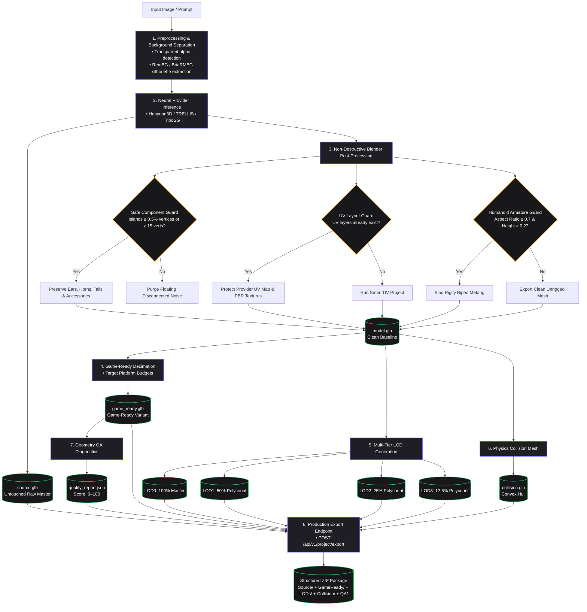
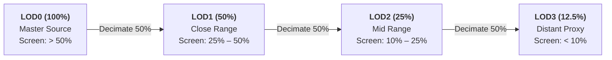
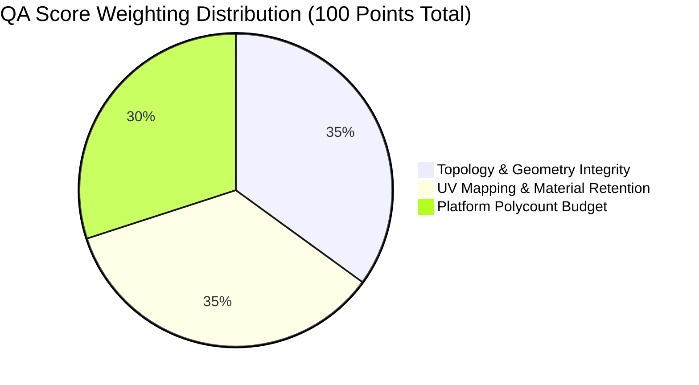

# 🏛️ AI 3D Studio

<p align="center">
  
</p>

<p align="center">
  <strong>Production-Grade AI 3D Generation, Optimization & Game-Ready Asset Pipeline</strong><br>
  Neural Reconstruction • Safe Post-Processing • Multi-Tier LODs • Physics Colliders • Automated QA • Multi-Format Export
</p>

<p align="center">
  
  
  
  
  
  
  
</p>

---

## ⚡ Overview

**AI 3D Studio** is an open-source generative 3D asset factory. It bridges state-of-the-art neural shape and texture synthesis models (**Hunyuan3D-2.1**, **Hunyuan3D-2 Mini**, **TRELLIS**, **TripoSG**) with a non-destructive production pipeline that preserves raw master geometry while generating engine-compliant game assets with automated Level-of-Detail (LOD) cascades, physics collision hulls, and objective QA validation scores.

---

## 🏗️ System Architecture

```mermaid
graph TB
    subgraph Client["Presentation & Workspace (Next.js 16 + Three.js)"]
        UI_VIEW["Interactive 3D Viewport<br/>(WebGL / OrbitControls / Matcaps)"]
        UI_GEN["Generate Panel<br/>(Platform Budgets & LOD Cascade)"]
        UI_EXP["Export Engine Modal<br/>(Variants, Conversions & ZIP Packaging)"]
    end

    subgraph API["Backend Gateway (FastAPI 0.115 / AsyncIO)"]
        ROUTER_GEN["/api/v1/generation"]
        ROUTER_EXP["/api/v1/project/export"]
        ROUTER_MODELS["/api/v1/models"]
        CACHE["In-Memory TTL & LRU Caches"]
    end

    subgraph Queue["Asynchronous Task Broker"]
        REDIS[("Redis :6379<br/>Task Queue & Locks")]
        CELERY["Celery Workers<br/>(Concurrency & GPU Slots)"]
    end

    subgraph Runtime["Runtime Engine & Provider Isolation"]
        SCHED["GPU Scheduler<br/>(Mutual Exclusion Slot)"]
        VRAM["VRAM Tracker & Low-VRAM Offload"]
        ENV["Dynamic ModelEnv Site-Packages Bridge"]
    end

    subgraph Providers["Generative AI Models"]
        HY21["Hunyuan3D-2.1 (Shape + Paint)"]
        HYMINI["Hunyuan3D-2 Mini (Fast DiT)"]
        TREL["TRELLIS (FlexiCubes PBR)"]
        TSG["TripoSG (Isosurface)"]
    end

    subgraph Pipeline["3D Quality Pipeline & Post-Processing"]
        BLENDER["Headless Blender 4.x<br/>(Safe Component Retention & UV Guard)"]
        OPT["Mesh Optimizer<br/>(Target Decimation & LOD0–LOD3)"]
        COL["Physics Collision<br/>(Convex Hull Generator)"]
        QA["QA Diagnostics<br/>(Topology & 0–100 Scoring)"]
    end

    subgraph Output["Production Asset Delivery"]
        MASTER["source.glb (Untouched Master)"]
        GAME["game_ready.glb (Engine Optimized)"]
        LODS["lods/lod0..3.glb (LOD Cascade)"]
        HULL["collision.glb (Physics Collider)"]
        ZIP["Structured ZIP Package"]
    end

    Client <==>|REST / SSE / WS| API
    API --> REDIS
    REDIS --> CELERY
    CELERY --> Runtime
    Runtime --> Providers
    Providers --> Pipeline
    Pipeline --> Output
    Output --> Client
```



---

## 🔄 3D Quality Pipeline Workflow



---

## 🎯 Target Platform Polygon Budgets

Game-ready decimation adheres to platform-specific polygon targets:

| Platform | Target Polycount | Max Vertices | Draw Calls | Recommended Use Case |
|---|---|---|---|---|
| **Mobile** | ≤ 18,000 tris | ~10,000 | 1–2 | Mobile WebGL, iOS/Android games, XR headsets |
| **Low** | ≤ 28,000 tris | ~16,000 | 1–2 | Low-end PC, Nintendo Switch, background props |
| **Medium** | ≤ 45,000 tris | ~25,000 | 1–3 | Standard PC/Console games, hero props, web interactive |
| **High** | ≤ 85,000 tris | ~50,000 | 1–4 | High-end PC/Console hero characters, Unreal Engine 5 |
| **Cinematic** | ≤ 180,000 tris | ~100,000 | 1–5 | Pre-rendered cinematics, virtual production |

---

## 📈 Multi-Tier Level of Detail (LOD) Cascade



---

## 📊 Automated QA Validation Rubric (0–100)

Every generated asset undergoes an objective evaluation producing a composite score:



- **Topology & Geometry (35 pts)**: Base non-zero geometry (+15), normal winding consistency (+10), watertight manifoldness (+5), clean component count (+5).
- **UVs & Materials (35 pts)**: Valid non-overlapping UV layout (+20), embedded PBR/Albedo texture map (+15).
- **Platform Budget (30 pts)**: Adherence to chosen target polycount (≤ 1.0x budget: +30, 1.0–1.5x: +20, 1.5–2.5x: +10).

| Status | Score Range | Engine Compatibility |
|---|---|---|
| 🟢 **PASS** | 80 – 100 | Ready for direct drag-and-drop into Unreal Engine, Unity, or Godot. |
| 🟡 **WARN** | 50 – 79 | Usable geometry with minor warnings (e.g. untextured mesh or slight budget overage). |
| 🔴 **FAIL** | < 50 | Requires re-generation or automated mesh repair. |

---

## 📦 Structured Export Architecture

When exporting via `POST /api/v1/project/export` with `package_zip=true`, the download is packaged into a structured game-ready archive:

```
Hero_Character.zip
├── Source/
│   └── source.glb            # Byte-for-byte untouched raw neural output
├── GameReady/
│   └── Hero_Character.glb    # Platform-optimized engine asset
├── LODs/
│   ├── lod0.glb              # 100% master fidelity
│   ├── lod1.glb              # 50% decimation
│   ├── lod2.glb              # 25% decimation
│   └── lod3.glb              # 12.5% distant proxy
├── Collision/
│   └── collision.glb         # Lightweight convex hull collider
└── QA/
    └── quality_report.json   # Machine-readable diagnostics & QA scores
```

---

## 🤖 Supported Model Catalog

| Provider | Category | VRAM Footprint | Output Format | Texture Pipeline |
|---|---|---|---|---|
| **Hunyuan3D-2.1** | 3D Shape & Texture | ~16 GB (8 GB low-VRAM) | Quad/Tri mesh | Multi-view neural paint diffusion |
| **Hunyuan3D-2 Mini** | Fast 3D Shape | ~6 GB | Triangle mesh | Front-projection fallback / paint PBR |
| **TRELLIS** | Structured 3D | ~16 GB (8 GB low-VRAM) | FlexiCubes mesh | Native PBR textures & materials |
| **TripoSG** | Fast Single-Image | ~6 GB | Isosurface mesh | High-fidelity vertex colors |
| **DetailGen3D** | Post-Processing | ~4 GB | Normal & displacement | Second-pass geometry refinement |

---

## 🚀 Quick Start

### 1. Local Development (Ubuntu 20.04/22.04/24.04 with NVIDIA GPU)

```bash
# Clone the repository
git clone https://github.com/Silentzx2/AI_Studio.git
cd AI_Studio

# Run automated system setup (installs Python 3.12, PyTorch CUDA, Blender 4.x, and dependencies)
sudo bash scripts/setup.sh

# Start application services (Backend :8000, Frontend :3000, Celery & Redis)
bash scripts/start.sh
```

### 2. Google Colab 1-Click Launch

Open a free or Pro Google Colab instance with T4/V100/A100 GPU and execute:

```bash
!git clone https://github.com/Silentzx2/AI_Studio.git /content/AI_Studio
%cd /content/AI_Studio
!bash scripts/colab.sh
```

The script configures the environment, starts all services, and prints a secure Cloudflare tunnel URL for instant browser access.

---

## 📚 Documentation Index

- [Architecture & Storage Guide](file:///teamspace/studios/this_studio/AI_Studio/Docs/architecture.md)
- [Complete REST API Documentation](file:///teamspace/studios/this_studio/AI_Studio/Docs/api-documentation.md)
- [Pipeline V2 Status & Changelog](file:///teamspace/studios/this_studio/AI_Studio/Docs/pipeline-status.md)
- [Developer & Testing Guide](file:///teamspace/studios/this_studio/AI_Studio/Docs/developer-guide.md)
- [System Architecture Blueprint](file:///teamspace/studios/this_studio/AI_Studio/Docs/SYSTEM-BLUEPRINT.md)
- [3D Quality Pipeline Specification](file:///teamspace/studios/this_studio/AI_Studio/PLANS/3D_QUALITY_PIPELINE.md)
- [Game-Ready Asset Specification](file:///teamspace/studios/this_studio/AI_Studio/PLANS/GAME_READY_SPEC.md)
- [Quality Benchmark & Verification](file:///teamspace/studios/this_studio/AI_Studio/PLANS/QUALITY_BENCHMARK.md)
- [Root Cause Diagnostic Report](file:///teamspace/studios/this_studio/AI_Studio/PLANS/ROOT_CAUSE_REPORT.md)

---

## 📄 License

This project is licensed under the MIT License — see the [LICENSE](file:///teamspace/studios/this_studio/AI_Studio/LICENSE) file for details.
